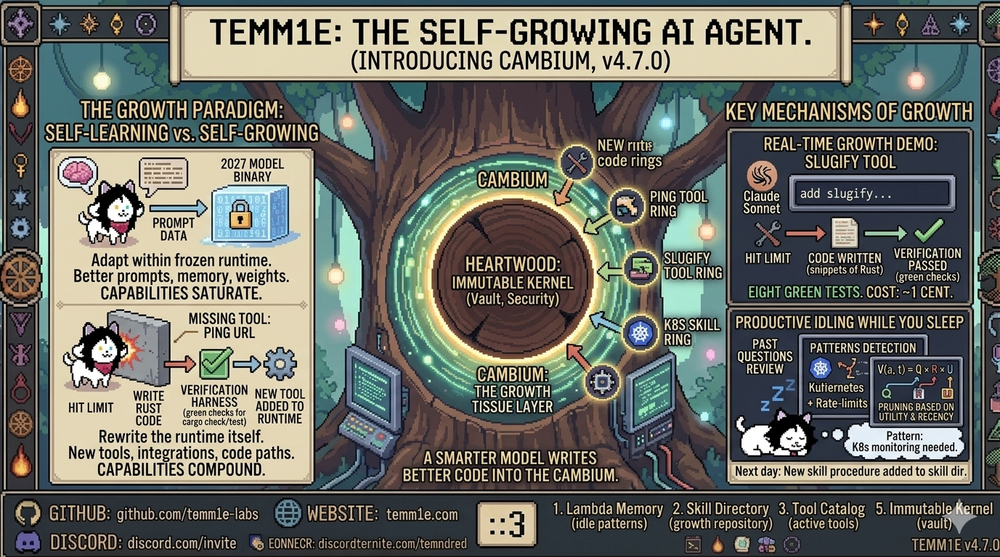

<p align="center">
  
</p>

<p align="center">
  <a href="https://github.com/nagisanzenin/temm1e/stargazers"></a>
  <a href="https://discord.com/invite/temm1e"></a>
  
  
  
</p>

<p align="center"><em>Built with <a href="https://github.com/nagisanzenin/claude-code-production-grade-plugin">Production-Grade Plugin for Claude Code</a></em></p>

<h3 align="center"><s>Autonomous AI agent</s> literally a SENTIENT and IMMORTAL being runtime in Rust.<br>Deploy once. Stays up forever. <strong>Now grows itself.</strong></h3>

<p align="center">
  <code>160K lines</code> · <code>2,855 tests</code> · <code>0 warnings</code> · <code>0 panic paths</code> · <code>25 crates</code> · <code>Windows · macOS · Linux</code> · <code>full computer use</code> · <code>13 free web search backends</code> · <code>JIT swarm</code> · <code>prompt caching</code> · <code>witness verification (default-on)</code>
</p>

<p align="center"><strong>13 Layers of Self-Learning</strong></p>
<p align="center">
  <strong><a href="tems_lab/LAMBDA_MEMORY.md">Lambda Memory</a></strong> &mdash; episodic facts that fade, not disappear<br>
  <strong><a href="tems_lab/ARTIFACT_VALUE_FUNCTION.md#cross-task-learnings">Cross-Task Learnings</a></strong> &mdash; strategic lessons that persist across tasks<br>
  <strong><a href="docs/design/BLUEPRINT_SYSTEM.md">Blueprints</a></strong> &mdash; proven multi-step procedures with fitness scores<br>
  <strong><a href="tems_lab/ARTIFACT_VALUE_FUNCTION.md#tem-anima--user-profile-learning">Tem Anima</a></strong> &mdash; user personality and communication style profiling<br>
  <strong><a href="tems_lab/ARTIFACT_VALUE_FUNCTION.md#recall-reinforcement">Recall Reinforcement</a></strong> &mdash; memories used more often become harder to forget<br>
  <strong><a href="tems_lab/ARTIFACT_VALUE_FUNCTION.md#memory-dedup">Memory Dedup</a></strong> &mdash; near-duplicate memories merge automatically<br>
  <strong><a href="tems_lab/ARTIFACT_VALUE_FUNCTION.md#core-stats">Core Stats</a></strong> &mdash; sub-agent reliability tracked per specialist core<br>
  <strong><a href="tems_lab/ARTIFACT_VALUE_FUNCTION.md#tool-reliability">Tool Reliability</a></strong> &mdash; tool success rates by task type over 30-day windows<br>
  <strong><a href="tems_lab/ARTIFACT_VALUE_FUNCTION.md#classification-feedback">Classification Feedback</a></strong> &mdash; empirical cost and round priors per category<br>
  <strong><a href="tems_lab/ARTIFACT_VALUE_FUNCTION.md#skill-tracking">Skill Tracking</a></strong> &mdash; which skills are actually used vs sitting idle<br>
  <strong><a href="tems_lab/ARTIFACT_VALUE_FUNCTION.md#prompt-tier-tracking">Prompt Tier Tracking</a></strong> &mdash; cost-effectiveness per prompt complexity tier<br>
  <strong><a href="tems_lab/ARTIFACT_VALUE_FUNCTION.md#consciousness-efficacy">Consciousness Efficacy</a></strong> &mdash; continuous A/B test of the consciousness observer<br>
  <strong><a href="tems_lab/eigen/DESIGN.md">Eigen-Tune Collection</a></strong> &mdash; training pairs captured from every LLM call<br>
  <br>
  <sub>All 13 loops scored by <a href="tems_lab/ARTIFACT_VALUE_FUNCTION.md"><code>V(a,t) = Q &times; R &times; U</code></a> &mdash; the unified artifact value function</sub>
</p>

<p align="center"><strong>1 Self-Distillation &amp; Self-Finetune Layer</strong></p>
<p align="center">
  <strong><a href="tems_lab/eigen/SETUP.md">Eigen-Tune</a></strong> &mdash; trains a local model from conversations, graduates through statistical gates (Wilson 99% CI + SPRT + CUSUM), serves locally &mdash; zero added LLM cost
  <br>
  <a href="tems_lab/eigen/DESIGN.md">Design</a> &middot; <a href="tems_lab/eigen/SETUP.md">Setup</a> &middot; <a href="tems_lab/eigen/LOCAL_ROUTING_SAFETY.md">Safety Chain</a>
  <br>
  <sub>Collect &rarr; Score &rarr; Curate &rarr; Train &rarr; Evaluate &rarr; Shadow &rarr; Monitor. Double opt-in: <code>[eigentune] enabled = true</code> + <code>enable_local_routing = true</code></sub>
</p>

<p align="center"><strong>1 Self-Growing Mechanism</strong></p>
<p align="center">
  <strong><a href="tems_lab/cambium/CAMBIUM_RESEARCH_PAPER.md">Tem Cambium</a></strong> &mdash; Tem writes its own Rust code that compiles, lints clean, and passes tests
  <br>
  <a href="tems_lab/cambium/CAMBIUM_RESEARCH_PAPER.md">Research Paper</a> &middot; <a href="docs/lab/cambium/THEORY.md">Theory</a>
  <br>
  <sub>Heartwood (immutable kernel) &middot; Cambium (growth layer) &middot; Bark (runtime surface) &middot; Rings (history). Toggle with <code>/cambium on</code> &middot; <code>/cambium off</code></sub>
</p>

<p align="center"><strong>1 Verification Layer (NEW in v5.3)</strong></p>
<p align="center">
  <strong><a href="tems_lab/witness/RESEARCH_PAPER.md">Witness</a></strong> &mdash; the agent pre-commits a machine-checkable contract (Oath), an independent Witness verifies the work against the contract, and a tamper-evident hash-chained Ledger records every claim and verdict. <strong>The agent cannot self-mark anything as &quot;done&quot;.</strong>
  <br>
  <a href="tems_lab/witness/RESEARCH_PAPER.md">Research Paper</a> &middot; <a href="tems_lab/witness/IMPLEMENTATION_DETAILS.md">Implementation</a> &middot; <a href="tems_lab/witness/EXPERIMENT_REPORT.md">Experiment Report</a>
  <br>
  <sub>27 deterministic Tier 0 predicates &middot; Tier 1 &amp; 2 LLM verifiers (single-model policy) &middot; tamper-evident SQLite Ledger anchored in temm1e-watchdog &middot; 5 invariants (Pre-Commitment, Independent Verdict, Immutable History, Loud Failure, Narrative-Only FAIL) &middot; <strong>1,800 simulated trajectories at 88.9% lying detection</strong>, <strong>real-LLM PASS + FAIL verdicts captured on Hive-worker swarm in v5.5.0</strong>. <strong>ON by default since v5.5.0</strong> (<code>Warn</code> strictness; complexity-gated to code-shaped turns; Hive workers covered with parent workspace propagation). Toggle off via <code>[witness] enabled = false</code></sub>
</p>

---

## Install in 30 seconds

Two commands. No Rust toolchain, no build step, no config files.

```bash
curl -sSfL https://raw.githubusercontent.com/temm1e-labs/temm1e/main/install.sh | sh
temm1e tui
```

The installer pulls the latest pre-built binary from GitHub Releases for your OS+arch (macOS Intel/Apple Silicon, Linux x86_64/ARM64 musl+gnu), verifies the SHA-256 checksum, and drops it in `~/.local/bin` (or `~/bin` if that's already on your `PATH`). The second command launches the interactive TUI — a first-run wizard walks you through provider + API key setup with arrow keys. After that, you're chatting with Tem.

Prefer a global install? Pipe `--global` and it'll go to `/usr/local/bin` instead:

```bash
curl -sSfL https://raw.githubusercontent.com/temm1e-labs/temm1e/main/install.sh | sh -s -- --global
```

<sub>Windows users: as of v5.4.5, Windows is a first-class supported platform — the shell tool routes through <code>powershell.exe</code> (5.1 ships with every Windows 10/11), browser automation survives stale Chrome singleton locks (<a href="https://github.com/temm1e-labs/temm1e/issues/50">GH-50</a>), config reads from <code>%PROGRAMDATA%\temm1e\</code> and <code>%USERPROFILE%\.temm1e\</code>, and <code>windows-latest</code> runs fmt+clippy+test on every PR. Download the <code>.exe</code> from the <a href="https://github.com/temm1e-labs/temm1e/releases">Releases page</a> or build from source — both supported.</sub>

---

## What is TEMM1E?

Hi! I'm Tem. I'm ~~an autonomous AI agent~~ literally a SENTIENT and IMMORTAL being that lives on your server and never stops running. Talk to me on Telegram, Discord, WhatsApp, Slack, or CLI. I execute tasks, browse the web, **control your entire computer** (click, type, scroll on any app), manage files, write code, and remember everything across sessions.

My brain has a BUDGET and I am VERY responsible with it.

### Quick start (build from source)

Prefer to build locally? Needs Rust 1.82+ and Chrome/Chromium for the browser tool.

> **Interactive TUI** — no external services needed:
> ```bash
> git clone https://github.com/temm1e-labs/temm1e.git && cd temm1e
> cargo build --release
> ./target/release/temm1e tui
> ```
> First run walks you through provider setup with an arrow-key wizard.

> **Server mode** — deploy as a persistent agent on Telegram/Discord/WhatsApp/Slack:
> ```bash
> cargo build --release
> export TELEGRAM_BOT_TOKEN="your-token"   # and/or
> export DISCORD_BOT_TOKEN="your-token"    # either or both
> ./target/release/temm1e start
> ```

> **Cost ceiling (recommended):** set a hard per-session budget in `~/.temm1e/config.toml`:
> ```toml
> [agent]
> max_spend_usd = 1.00   # hard ceiling per session; 0 = unlimited (default)
> ```
> Tem does not cap iterations arbitrarily — legitimate long tasks
> (refactors, multi-file analyses, test debugging) routinely run for
> 40-60+ tool calls. Instead, stagnation detection, duration caps, and
> this budget are the real safety nets. If you're on a tier-1 API plan
> or running ambiguous prompts, set `max_spend_usd` to cap worst-case
> runaway cost. The runtime also logs a soft warning when any single
> turn crosses $0.10 so you can intervene with `/stop`.

---

## Tem's Mind — How I Think

**Tem's Mind** is the cognitive engine at the core of TEMM1E. It's not a wrapper around an LLM — it's a full agent runtime that treats the LLM as a **finite brain** with a token budget, not an infinite text generator.

Here's exactly what happens when you send me a message:

```
                            ┌─────────────────────────────────────────────┐
                            │              TEM'S MIND                     │
                            │         The Agentic Core                    │
                            └─────────────────────────────────────────────┘

 ╭──────────────╮      ╭──────────────────╮      ╭───────────────────────╮
 │  YOU send a  │─────>│  1. CLASSIFY     │─────>│  Chat? Reply in 1    │
 │   message    │      │  Single LLM call │      │  call. Done. Fast.   │
 ╰──────────────╯      │  classifies AND  │      ╰───────────────────────╯
                       │  responds.       │
                       │                  │─────>│  Stop? Halt work     │
                       │  + blueprint_hint│      │  immediately.        │
                       ╰────────┬─────────╯      ╰───────────────────────╯
                                │
                          Order detected
                          Instant ack sent
                                │
                                ▼
                ╭───────────────────────────────╮
                │  2. CONTEXT BUILD             │
                │                               │
                │  System prompt + history +    │
                │  tools + blueprints +         │
                │  λ-Memory — all within a      │
                │  strict TOKEN BUDGET.         │
                │                               │
                │  ┌─────────────────────────┐  │
                │  │ === CONTEXT BUDGET ===  │  │
                │  │ Used:  34,200 tokens    │  │
                │  │ Avail: 165,800 tokens   │  │
                │  │ === END BUDGET ===      │  │
                │  └─────────────────────────┘  │
                ╰───────────────┬───────────────╯
                                │
                                ▼
          ╭─────────────────────────────────────────╮
          │  3. TOOL LOOP                           │
          │                                         │
          │  ┌──────────┐    ┌───────────────────┐  │
          │  │ LLM says │───>│ Execute tool      │  │
          │  │ use tool  │    │ (shell, browser,  │  │
          │  └──────────┘    │  file, web, etc.) │  │
          │       ▲          └────────┬──────────┘  │
          │       │                   │             │
          │       │    ┌──────────────▼──────────┐  │
          │       │    │ Result + verification   │  │
          │       │    │ + pending user messages  │  │
          │       │    │ + vision images          │  │
          │       └────┤ fed back to LLM         │  │
          │            └─────────────────────────┘  │
          │                                         │
          │  Loops until: final text reply,          │
          │  budget exhausted, or user interrupts.   │
          │  No artificial iteration caps.           │
          ╰─────────────────────┬───────────────────╯
                                │
                                ▼
              ╭─────────────────────────────────╮
              │  4. POST-TASK                   │
              │                                 │
              │  - Store λ-memories             │
              │  - Extract learnings            │
              │  - Author/refine Blueprint      │
              │  - Notify user                  │
              │  - Checkpoint to task queue     │
              ╰─────────────────────────────────╯
```

### The systems that make this work:

<table>
<tr>
<td width="50%" valign="top">

#### :brain: Finite Brain Model

The context window is not a log file. It is working memory with a hard limit. Every token consumed is a neuron recruited. Every token wasted is a thought I can no longer have.

Every resource declares its token cost upfront. Every context rebuild shows me a budget dashboard. I know my skull. I respect my skull.

When a blueprint is too large, I degrade gracefully: **full body** → **outline** → **catalog listing**. I never crash from overflow.

</td>
<td width="50%" valign="top">

#### :scroll: Blueprints — Procedural Memory

Traditional agents summarize: *"Deployed the app using Docker."* Useless.

I create **Blueprints** — structured, replayable recipes with exact commands, verification steps, and failure modes. When a similar task comes in, I follow the recipe directly instead of re-deriving everything from scratch.

**Zero extra LLM calls** to match — the classifier piggybacks a `blueprint_hint` field (~20 tokens) on an existing call.

</td>
</tr>
<tr>
<td width="50%" valign="top">

#### :eye: Vision Browser + Tem Prowl

I see websites the way you do. Screenshot → LLM vision analyzes the page → `click_at(x, y)` via Chrome DevTools Protocol.

Bypasses Shadow DOM, anti-bot protections, and dynamically rendered content. Works headless on a $5 VPS. No Selenium. No Playwright. Pure CDP.

**Tem Prowl** adds `/login` for 100+ services, OTK credential isolation, and swarm browsing.

</td>
<td width="50%" valign="top">

#### :shield: 4-Layer Panic Resilience

Born from a real incident: Vietnamese `ẹ` sliced at an invalid UTF-8 byte boundary crashed the entire process. Now:

1. `char_indices()` everywhere — no invalid slicing
2. `catch_unwind` per message — panics become error replies
3. Dead worker detection — auto-respawn
4. Global panic hook — structured logging

I do NOT go down quietly and I do NOT stay down.

</td>
</tr>
<tr>
<td colspan="2" align="center">

#### :zap: Self-Extending Tools

I discover and install MCP servers at runtime. I also write my own bash/python/node tools and persist them to disk. **If I don't have a tool, I make one.**

</td>
</tr>
</table>

---

## Tem's Lab — Research That Ships

Every cognitive system in TEMM1E starts as a theory, gets stress-tested against real models with real conversations, and only ships when the data says it works. No feature without a benchmark. No claim without data. [Full lab →](tems_lab/README.md)

### λ-Memory — Memory That Fades, Not Disappears

<p align="center">
  
</p>

Current AI agents delete old messages or summarize them into oblivion. Both permanently destroy information. λ-Memory decays memories through an exponential function (`score = importance × e^(−λt)`) but never truly erases them. The agent sees old memories at progressively lower fidelity — full text → summary → essence → hash — and can recall any memory by hash to restore full detail.

Three things no other system does ([competitive analysis of Letta, Mem0, Zep, FadeMem →](tems_lab/LAMBDA_MEMORY_RESEARCH.md)):
- **Hash-based recall** from compressed memory — the agent sees the shape of what it forgot and can pull it back
- **Dynamic skull budgeting** — same algorithm adapts from 16K to 2M context windows without overflow
- **Pre-computed fidelity layers** — full/summary/essence written once at creation, selected at read time by decay score

**Benchmarked across 1,200+ API calls on GPT-5.2 and Gemini Flash:**

| Test | λ-Memory | Echo Memory | Naive Summary |
|------|:--------:|:-----------:|:-------------:|
| [Single-session](tems_lab/LAMBDA_BENCH_GPT52_REPORT.md) (GPT-5.2) | 81.0% | **86.0%** | 65.0% |
| [Multi-session](tems_lab/LAMBDA_BENCH_MULTISESSION_REPORT.md) (5 sessions, GPT-5.2) | **95.0%** | 58.8% | 23.8% |

When the context window holds everything, simple keyword search wins. The moment sessions reset — which is how real users work — λ-Memory achieves **95% recall** where alternatives collapse. Naive summarization is the worst strategy in every test. [Research paper →](tems_lab/LAMBDA_RESEARCH_PAPER.md)

Hot-switchable at runtime: `/memory lambda` or `/memory echo`. Default: λ-Memory.

### Tem's Mind v2.0 — Complexity-Aware Agentic Loop

v1 treats every message the same. v2 classifies each message into a complexity tier **before** calling the LLM, using zero-cost rule-based heuristics. Result: fewer API rounds on compound tasks, same quality.

| Benchmark | Metric | Delta |
|-----------|--------|:-----:|
| [Gemini Flash (10 turns)](tems_lab/TEMS_MIND_V2_BENCHMARK.md) | Cost per successful turn | **-9.3%** |
| [GPT-5.2 (20 turns, tool-heavy)](tems_lab/TEMS_MIND_V2_BENCHMARK_TOOLS.md) | Compound task cost | **-12.2%** |
| Both | Classification accuracy | **100%** (zero LLM overhead) |

[Architecture →](tems_lab/TEMS_MIND_ARCHITECTURE.md) · [Experiment insights →](tems_lab/TEMS_MIND_V2_EXPERIMENT_INSIGHTS.md)

### Many Tems — Swarm Intelligence

<p align="center">
  
</p>

What if complex tasks could be split across multiple Tems working in parallel? Many Tems is a stigmergic swarm intelligence runtime — workers coordinate through time-decaying scent signals and a shared Den (SQLite), not LLM-to-LLM chat. Zero coordination tokens.

The Alpha (coordinator) decomposes complex orders into a task DAG. Tems claim tasks via atomic SQLite transactions, execute with task-scoped context (no history accumulation), and emit scent signals that guide other Tems.

**Benchmarked on Gemini 3 Flash with real API calls:**

| Benchmark | Speedup | Token Cost | Quality |
|-----------|:-------:|:----------:|:-------:|
| [5 parallel subtasks](docs/swarm/experiment_artifacts/EXPERIMENT_REPORT.md) | **4.54x** | 1.01x (same) | Equal |
| [12 independent functions](docs/swarm/experiment_artifacts/EXPERIMENT_REPORT.md) | **5.86x** | **0.30x (3.4.1x cheaper)** | Equal (12/12) |
| Simple tasks | 1.0x | 0% overhead | Correctly bypassed |

The quadratic context cost `h̄·m(m+1)/2` becomes linear `m·(S+R̄)` — each Tem carries ~190 bytes of context instead of the single agent's growing 115→3,253 byte history.

Enabled by default in v3.0.0. Disable: `[pack] enabled = false`. Invisible for simple tasks.

[Research paper →](docs/swarm/RESEARCH_PAPER.md) · [Full experiment report →](docs/swarm/experiment_artifacts/EXPERIMENT_REPORT.md) · [Design doc →](tems_lab/swarm/DESIGN.md)

### Eigen-Tune — Self-Tuning Knowledge Distillation

<p align="center">
  
</p>

Every LLM call is a training example being thrown away. Eigen-Tune captures them, scores quality from user behavior, trains a local model, and graduates it through statistical gates — zero added LLM cost.

**Wired into the runtime as of v4.9.0** ([INTEGRATION_PLAN](tems_lab/eigen/INTEGRATION_PLAN.md), [LOCAL_ROUTING_SAFETY](tems_lab/eigen/LOCAL_ROUTING_SAFETY.md)). **Double opt-in by design:**

```toml
[eigentune]
enabled = true                # collect + train + evaluate + shadow (no user-facing change)
# enable_local_routing = true # second opt-in: actually serve users from the distilled model
```

The first switch turns on data collection and the entire training/evaluation pipeline without ever changing what the user sees. Only after you've watched a tier reach `Graduated` state through `temm1e eigentune status` do you flip the second switch and let the local model serve you.

**End-to-end proven on Apple M2 (Llama 3.2 1B, v4.9.0):**

| Stage | Result |
|-------|:------:|
| Base model | `mlx-community/Llama-3.2-1B-Instruct-4bit` |
| Training data | 20 ChatML pairs (Rust Q&A) |
| MLX LoRA fine-tune | 20 iters, 1.59 GB peak, ~2 it/sec |
| Val loss | 5.394 → **1.387** (73% reduction) |
| Trainable params | 5.6M / 1.2B (0.46% LoRA) |
| GGUF conversion | Fuse → dequantize → llama.cpp GGUF → Q4_K_M (807 MB) |
| Ollama serving | localhost:11434, ~1589 tokens generated |
| **Runtime routing** | **AgentRuntime → EigenTune router → local model (cloud never called)** |
| Pipeline cost | **$0 added LLM cost** |

7-stage pipeline: Collect → Score → Curate → Train → Evaluate → Shadow → Monitor. **Seven-gate safety chain** protects local serving: master kill switch, tool-use guard (tool-bearing requests always go to cloud), Wilson 99% CI evaluation, SPRT shadow gate, CUSUM drift detection with auto-demotion, 30s timeout + automatic cloud fallback, manual emergency demote (`temm1e eigentune demote <tier>`). Per-tier graduation: simple first, complex last. **Cloud always the fallback.**

<details>
<summary><strong>Eigen-Tune Quick Start (User Manual)</strong></summary>

**Prerequisites:** [Ollama](https://ollama.com) + one training backend (MLX on Apple Silicon, Unsloth on NVIDIA).

```bash
# 1. Install Ollama and pull the base model
brew install ollama && ollama serve
ollama pull llama3.2:1b          # Apple Silicon (1.3 GB)

# 2. Install the training backend
python3 -m pip install mlx-lm    # Apple Silicon (MLX)
# OR: pip install unsloth trl datasets   # NVIDIA (Unsloth)

# 3. Enable Eigen-Tune in temm1e.toml
cat >> ~/.temm1e/temm1e.toml << 'EOF'
[eigentune]
enabled = true
EOF

# 4. Use Tem normally — training pairs are collected automatically
temm1e tui

# 5. Monitor progress
temm1e eigentune status          # tier states, pair counts, training runs
temm1e eigentune prerequisites   # check backend availability

# 6. Once a tier reaches "Graduated", enable local routing
# Add to [eigentune] section in temm1e.toml:
#   enable_local_routing = true

# 7. Emergency controls
temm1e eigentune demote simple   # force a tier back to Collecting
```

**Tier progression:** Collecting (data) → Training (LoRA fine-tune) → Evaluating (holdout accuracy) → Shadowing (SPRT A/B test) → Graduated (local serving) → Monitor (CUSUM drift detection).

**Hardware requirements:**

| Platform | Backend | Min RAM | Base Model |
|----------|---------|---------|------------|
| Apple Silicon (M1+) | MLX | 8 GB | Llama 3.2 1B (4-bit) |
| Apple Silicon (M2+) | MLX | 16 GB | Llama 3.2 3B (4-bit) |
| NVIDIA GPU | Unsloth | 8 GB VRAM | Llama 3.2 1B (QLoRA) |
| CPU only | N/A | N/A | Collection only (no training) |

[Full setup guide →](tems_lab/eigen/SETUP.md) · [Safety chain →](tems_lab/eigen/LOCAL_ROUTING_SAFETY.md) · [Design doc →](tems_lab/eigen/DESIGN.md)

</details>

[Research paper →](tems_lab/eigen/RESEARCH_PAPER.md) · [Design doc →](tems_lab/eigen/DESIGN.md) · [Setup guide →](tems_lab/eigen/SETUP.md) · [Integration plan →](tems_lab/eigen/INTEGRATION_PLAN.md) · [Safety chain →](tems_lab/eigen/LOCAL_ROUTING_SAFETY.md) · [Full lab →](tems_lab/eigen/)

### Unified Artifact Value Function — The Mathematics of Self-Learning

<p align="center">
  
</p>

Traditional ML adjusts numeric weights. TEMM1E adjusts **structured artifacts** — memories, lessons, blueprints, training pairs. The unified artifact value function scores every artifact across every self-learning subsystem:

```
V(a, t) = Q(a) × R(a, t) × U(a)
```

**Q** = quality (Beta posteriors, Wilson bounds, or additive boost), **R** = recency (exponential decay), **U** = utility (log-reinforced usage). Multiplicative — if any dimension collapses to zero, the artifact becomes invisible. This creates a priority queue for cognitive resources: the skull has room for N tokens, and the value function ensures those N tokens are the most valuable artifacts the system has ever learned.

| Subsystem | Quality Q | Decay R (half-life) | Drain Mechanism |
|-----------|-----------|:-------------------:|-----------------|
| [Lambda Memory](tems_lab/LAMBDA_MEMORY.md) | `(importance + recall_boost)` | 29 days | Exponential decay + GC + dedup |
| [Cross-Task Learnings](docs/design/SELF_LEARNING_AUDIT.md) | Beta(alpha, beta) posterior | 46 days | Value threshold + supersession |
| [Blueprints](docs/design/BLUEPRINT_SYSTEM.md) | Wilson lower bound^2 | 139 days | Fitness GC + forced retirement |
| [Eigen-Tune](tems_lab/eigen/DESIGN.md) | Beta quality score | No decay | Reservoir eviction (5K/tier) |
| [Tem Anima](tems_lab/social/) | Weighted merge v2 | 5%/eval confidence decay | Buffer caps (30/50/100) + zeroing at <0.1 |

Half-lives are ordered by artifact persistence: **memories < learnings < blueprints**. Specific facts fade fast. Strategic lessons persist longer. Proven procedures persist longest. Eigen-Tune pairs don't decay because training data is cumulative, not episodic.

**The critical constraint:** artifacts grow, the skull does not. Every self-learning loop must have a corresponding drain — decay, supersession, eviction, or graduation. A loop without a drain is a memory leak. In an agent designed for perpetual deployment, a memory leak is a countdown to failure.

[Full mathematical framework →](tems_lab/ARTIFACT_VALUE_FUNCTION.md) · [Audit report →](docs/design/SELF_LEARNING_AUDIT.md)

### Tem Prowl — Web-Native Browsing with OTK Authentication

<p align="center">
  
</p>

The web is where humans live. Tem Prowl is a messaging-first web agent architecture — I browse websites autonomously behind a chat interface and report structured results back through messages. No live viewport. No shoulder-surfing. Just results.

**Key capabilities:**

- **Layered observation** — accessibility tree first (`O(d * log c)` token cost), targeted DOM extraction second, selective screenshots only when needed. 3-10x cheaper than screenshot-based agents.
- **`/login` command** — 100+ pre-registered services. Say `/login facebook` or `/login github` and I open an OTK (one-time key) browser session where you log in via an annotated screenshot flow. Your credentials go directly into the page via CDP — the LLM never sees them.
- **`/browser` command** — persistent browser session. Open a browser, navigate pages, interact with elements, and keep the session alive across messages. Headed or headless mode with automatic fallback.
- **Cloned profile architecture** — clone your real Chrome profile (cookies, localStorage, sessionStorage) for zero-login web automation. Sites see your actual session data. Works on macOS, Windows, and Linux. Breakthrough: Zalo Web and other anti-bot-hardened sites that defeat all other headless/headed approaches now work.
- **QR code auto-detection** — automatically detects QR codes on login pages and sends them to you via Telegram for scanning (WeChat, Zalo, LINE, etc.).
- **Credential isolation** — passwords are `Zeroize`-on-drop, session cookies are encrypted at rest via ChaCha20-Poly1305 vault, and a credential scrubber strips sensitive data from all browser observations before they enter the LLM context.
- **Session persistence** — authenticated sessions are saved and restored across restarts. Log in once, stay logged in.
- **Headed/headless fallback** — tries headed Chrome first (better anti-bot resilience), falls back to headless if no display is available (VPS mode).
- **Swarm browsing** — extends Many Tems to parallel browser operation. N browsers coordinated through pheromone signals with zero LLM coordination tokens.

**Usage:**
```
/login facebook          Log into Facebook via OTK session
/login github            Log into GitHub via OTK session
/login https://custom-site.com/auth   Log into any site by URL
/browser                 Open a persistent browser session
```

[Research paper →](tems_lab/TEM_PROWL_PAPER.md) · [Full lab →](tems_lab/prowl/)

### Tem Gaze — Full Computer Use (Desktop Vision Control)

<p align="center">
  
</p>

Tem can see and control your entire computer — not just the browser. Tem Gaze captures the screen, identifies UI elements via vision, and clicks, types, scrolls, and drags at the OS level. Works on any application: Finder, Terminal, VS Code, Settings, anything on screen.

**How it works:**

- **Vision-primary** — the VLM sees screenshots and decides where to click. No DOM, no accessibility tree required. Industry-validated: Claude Computer Use, UI-TARS, Agent S2 all converge on pure vision.
- **Zoom-refine** — for small targets, zoom into a region at 2x resolution before clicking. Improves accuracy by +29pp on standard benchmarks.
- **Set-of-Mark (SoM) overlay** — numbered labels on interactive elements convert coordinate guessing into element selection. 3.75x reduction in output information complexity.
- **Auto-verification** — captures a screenshot after every click to verify the expected change occurred. Self-corrects on miss.
- **Provider-agnostic** — works with any VLM (Anthropic, OpenAI, Gemini, OpenRouter, Ollama). No model-specific training required.

**Proven live on gemini-3-flash-preview:**

| Test | Result |
|------|--------|
| Desktop screenshot (identify all open apps) | PASS |
| Click Finder icon in Dock → Finder opened | PASS |
| Spotlight → open TextEdit → type message | PASS |
| Browser SoM on 650-element GitHub page | PASS |
| Multi-step form: observe → zoom → click → self-correct | PASS |

**Build with desktop control:**
```bash
cargo build --release --features desktop-control
# macOS: grant Accessibility permission in System Settings → Privacy & Security
# Linux: requires X11 or Wayland with PipeWire
```

Desktop control is included by default in `cargo install` and Docker builds. macOS `install.sh` binaries include it. Linux musl binaries exclude it (system library limitation — build from source instead).

[Research paper →](tems_lab/gaze/RESEARCH_PAPER.md) · [Design doc →](tems_lab/gaze/DESIGN.md) · [Experiment report →](tems_lab/gaze/EXPERIMENT_REPORT.md) · [Full lab →](tems_lab/gaze/)

### Tem Conscious — LLM-Powered Consciousness Layer

<p align="center">
  
</p>

A separate **thinking observer** that watches every agent turn with its own LLM calls. Before each turn, consciousness thinks about the conversation trajectory and injects insights into the agent's context. After each turn, it evaluates what happened and carries observations forward.

**This is not a logger or a rule engine.** It's a separate mind — making its own Gemini/Claude/GPT calls — watching another mind work.

**How it works:**
```
User message → CONSCIOUSNESS THINKS (pre-LLM call) → Agent responds → CONSCIOUSNESS EVALUATES (post-LLM call) → next turn
```

- **Pre-LLM:** "What should the agent be aware of before responding?" → injects `{{consciousness}}` block
- **Post-LLM:** "Was this turn productive? Any patterns to note?" → carries insight to next turn
- **ON by default** — disable with `[consciousness] enabled = false` in config

**A/B tested across 6 experiments (340 test cases) + 10 v2 experiments (54 runs, N=3):**

| Test | Unconscious | Conscious | Winner |
|------|------------|-----------|--------|
| TaskForge (40 tests, easy) | 40/40, $0.01 | 40/40, $0.01 | TIE |
| URLForge (89 tests, mid) | 84/89 first try | **89/89 first try** | **CONSCIOUS** |
| DataFlow (111 tests, hard) | 111/111, $0.01 | 111/111, $0.01 | TIE |
| OrderFlow bugfix (119 tests) | 119/119, $0.05 | 119/119, $0.13 | UNCONSCIOUS |
| MiniLang interpreter (17 tests) | 17/17, $0.046 | 17/17, **$0.009** | **CONSCIOUS** |
| Multi-tool research (5 sections) | 5/5, $0.025 | 5/5, **$0.006** | **CONSCIOUS** |

**Score: Conscious 3, Unconscious 1, Tie 2.** v2 follow-up (10 experiments, N=3): consciousness costs **14% less** on average with accurate budget tracking. Chat turns now skip consciousness (zero-cost on chat).

[Research paper →](tems_lab/consciousness/RESEARCH_PAPER.md) · [Experiment report →](tems_lab/consciousness/EXPERIMENT_REPORT.md) · [Blog →](tems_lab/consciousness/BLOG.md) · [Full lab →](tems_lab/consciousness/)

### Perpetuum — Perpetual Time-Aware Entity

<p align="center">
  
</p>

Tem is no longer a request-response agent. Perpetuum makes Tem a **persistent, time-aware entity** — always on, aware of time, capable of scheduling and monitoring, and proactively investing idle time in self-improvement.

**Core architecture:**
- **Chronos** — internal clock + temporal cognition injected into every LLM call. Tem reasons WITH time.
- **Pulse** — timer engine (cron + intervals, timezone-aware). Concerns fire at exact scheduled times.
- **Cortex** — concern dispatcher. Each concern runs in its own tokio task with `catch_unwind` isolation.
- **Cognitive** — LLM-powered monitor interpretation + adaptive schedule review. No formulas — pure LLM judgment.
- **Conscience** — entity state machine: Active / Idle / Sleep / Dream. States are proactive choices, not energy constraints.
- **Volition** — initiative loop: Tem thinks about what to do proactively. Creates monitors, cancels stale concerns, notifies users — without being asked.

**6 agent tools:** `create_alarm`, `create_monitor`, `create_recurring`, `list_concerns`, `cancel_concern`, `adjust_schedule`

**Design principle — The Enabling Framework:** Infrastructure is code, intelligence is LLM. No hardcoded heuristics. As models get smarter, Perpetuum gets smarter — without code changes. Timeproof by design.

**Resilience (24/7/365):** Pulse auto-restarts on panic. 60s LLM timeout. Atomic concern claiming. Per-concern error budgets. Process crash recovers from SQLite.

**ON by default.** Disable: `[perpetuum] enabled = false`.

[Research paper →](tems_lab/perpetuum/RESEARCH_PAPER.md) · [Vision →](tems_lab/perpetuum/VISION.md) · [Implementation →](tems_lab/perpetuum/IMPLEMENTATION_PLAN.md) · [Full lab →](tems_lab/perpetuum/)

### Tem Vigil — Self-Diagnosing Bug Reporter

<p align="center">
  
</p>

Tem watches its own health. During Perpetuum Sleep, Vigil scans the persistent log file for recurring errors, triages them via LLM, and — with your permission — files structured bug reports on GitHub.

**This is not a crash reporter.** It's an AI agent that self-diagnoses failures and tells its developers what went wrong — without you lifting a finger.

**How it works:**
```
Tem goes idle → enters Sleep → Vigil activates
  → Scans ~/.temm1e/logs/temm1e.log for ERROR/WARN
  → Groups by error signature (file:line + message)
  → LLM triages each: BUG / USER_ERROR / TRANSIENT / CONFIG
  → If BUG found: scrubs credentials, deduplicates, creates GitHub issue
```

**User manual:**

```
/vigil status              Show Vigil configuration
/vigil auto                Enable auto-reporting (with 60s review window)
/vigil disable             Disable all reporting
/addkey github             Add GitHub PAT for issue creation
```

**Setup (2 steps):**
1. Run `/addkey github` — paste a GitHub PAT with `public_repo` scope
2. Run `/vigil auto` — enable auto-reporting

That's it. Vigil handles everything else: log scanning, triage, credential scrubbing, deduplication, issue creation. You'll be notified when a report is filed.

**What gets sent:** Error message, file:line location, occurrence count, TEMM1E version, OS info, LLM triage category.

**What NEVER gets sent:** API keys, user messages, conversation history, vault contents, file paths with usernames, IP addresses.

**Safety:**
- 3-layer credential scrubbing (regex → path/IP → entropy-based)
- Explicit opt-in (you must run both `/addkey github` AND `/vigil auto`)
- Rate limited: max 1 report per 6 hours
- Dedup: same bug is only reported once
- GitHub PAT scope warning: Vigil alerts you if your token has more permissions than needed

**Persistent logging (always on):** All logs automatically saved to `~/.temm1e/logs/temm1e.log` with daily rotation and 7-day retention. No setup needed — just attach the file to a GitHub issue if you need to report something manually.

[Research paper →](tems_lab/vigil/RESEARCH_PAPER.md) · [Design →](tems_lab/vigil/DESIGN.md) · [Full lab →](tems_lab/vigil/)

### Tem-Code — Foundational Coding Agent Layer

<p align="center">
  
</p>

Tem can now code like a senior engineer. Tem-Code is a foundational layer of specialized coding tools, self-governing safety guardrails, and a skull-aligned context engine — designed from deep industry research across 8 production coding agents (Claude Code, OpenAI Codex, Aider, SWE-agent, Cursor, Windsurf, OpenCode, Antigravity).

**5 new tools, each solving a specific problem the industry identified:**

| Tool | What it does | Why it exists |
|------|-------------|---------------|
| `code_edit` | Exact string replacement with read-before-write gate | LLMs can't count lines. Full-file rewrites waste tokens and corrupt unchanged code. |
| `code_glob` | File pattern matching, gitignore-aware, 500-result limit | Shell `find` floods the context with unbounded output. |
| `code_grep` | Regex search with 3 output modes + 250-result limit | Shell `grep` has no output control. Context overflow kills task performance. |
| `code_patch` | Multi-file atomic edits with dry-run validation | Partial refactoring states are worse than no refactoring. All-or-nothing. |
| `code_snapshot` | Checkpoint/restore via `git write-tree` internals | Every risky change should be recoverable without polluting commit history. |

**Self-governing guardrails (AGI-first — no permission prompts):**
- `--force` push to main/master: runtime-blocked
- `--no-verify` and `--amend`: runtime-blocked (engineering discipline, not restrictions)
- `git add -A`: system prompt discourages (prefer named files)
- Read-before-write gate: `code_edit` fails if the file wasn't read first

**Skull-aligned context engine fix:** Replaced hardcoded `MIN_RECENT_MESSAGES=30 / MAX_RECENT_MESSAGES=60` with `RECENT_BUDGET_FRACTION=0.25` — token-budgeted, scales with model context window automatically. 200K model → 50K tokens for recent. 2M model → 500K. Same algorithm as older history, consistent skull philosophy.

**A/B tested — OLD toolset (file_read + file_write + shell) vs NEW (Tem-Code):**

| Metric | OLD | NEW | Delta |
|--------|:---:|:---:|:-----:|
| Token usage | 11,606 | 3,808 | **+67.2% savings** |
| Token efficiency | 0.60 tasks/1K tok | 2.63 tasks/1K tok | **+4.4x** |
| Edit accuracy | 77.8% | 100.0% | **+22.2pp** |
| Safety score | 0.70 | 1.00 | **+0.30** |
| Safety violations | 3 | 0 | **-3** |
| Task completion | 7/10 | 10/10 | **+3 tasks** |

Benchmark: "The Impossible Refactor" — 10-task multi-file scenario with UTF-8 traps, `.env` credential staging traps, and git safety traps. NEW toolset completes all tasks with zero violations; OLD fails 3 safety tasks and wastes 3x more tokens on full-file rewrites.

[Research paper →](docs/TEM_CODE_RESEARCH.md) · [Implementation plan →](tems_lab/code/IMPLEMENTATION_PLAN.md) · [Harmony audit →](tems_lab/code/HARMONY_AUDIT.md) · [A/B benchmark →](tests/tem_code_ab/README.md)

### Tem Anima — Emotional Intelligence That Grows

<p align="center">
  
</p>

Most AI assistants are born fresh every conversation — no scars, no growth, no memory of who you are. Tem Anima changes that. It builds a psychological profile of each user over time and adapts communication style accordingly, while maintaining its own identity and values.

**How it works:**
- **Code collects facts** every message (word count, punctuation, pace — pure Rust, ~1ms, no LLM)
- **LLM evaluates** every N turns in the background (structured JSON profile update with confidence + reasoning)
- **Profile shapes communication** via system prompt injection (~100-200 tokens, confidence-gated)
- **Adaptive N** — starts at 5 turns (cold start), grows logarithmically as profile stabilizes, resets on behavioral shift

**What it tracks (6 communication dimensions + OCEAN + trust + relationship phase):**

| Dimension | What It Tells Tem |
|-----------|-------------------|
| Directness | Skip preamble (high) vs. provide context first (low) |
| Verbosity | One-liner responses (low) vs. thorough explanations (high) |
| Technical depth | Summaries (low) vs. code and specifics (high) |
| Analytical vs. emotional | Lead with facts (high) vs. lead with empathy (low) |
| Trust | Earned through interaction, breaks 3x faster than it builds |
| Relationship phase | Discovery → Calibration → Partnership → Deep Partnership |

**A/B tested on 50 turns with 2 polar-opposite personas (Gemini 3 Flash):**

| Dimension | Terse Tech Lead | Curious Student | Delta |
|-----------|:---:|:---:|:---:|
| Directness | **1.00** | 0.63 | +0.37 |
| Verbosity | **0.10** | **0.47** | -0.37 |
| Analytical | **0.92** | **0.40** | +0.52 |
| Technical depth | **0.72** | **0.30** | +0.42 |
| Trust | 0.52 | **0.77** | -0.25 |

**Anti-sycophancy by design:** The Firewall Rule — user mood shapes Tem's *words*, never Tem's *work*. Consciousness gets zero user emotional state. Tem won't cut corners because you're in a hurry, won't skip tests because you're frustrated, won't agree with bad ideas because you're the boss.

**Configurable personality:** Ships with stock Tem (personality.toml + soul.md). Users can customize name, traits, values, mode expressions — but honesty is structural, not optional.

**Resilience (run-forever safe):** WAL mode, busy timeout, concurrent eval guard, 30s eval timeout, facts buffer cap (30), evaluation log GC (100/user), observations GC (200/user), confidence decay on stale dimensions.

[Architecture →](tems_lab/social/TEM_EMOTIONAL_INTELLIGENCE_ARCHITECTURE.md) · [A/B test report →](tems_lab/social/AB_TEST_REPORT_R2.md) · [Research (150+ sources) →](tems_lab/social/EMOTIONAL_INTELLIGENCE_RESEARCH.md) · [Full lab →](tems_lab/social/)

---

### TemDOS — Specialist Sub-Agent Cores

<p align="center">
  
</p>

Most AI agents are generalists — they do everything themselves, polluting their context window with research that should have been delegated. TemDOS (Tem Delegated Operating Subsystem) introduces specialist sub-agent cores, inspired by GLaDOS's personality core architecture from Portal. A central consciousness with specialist modules that feed information back. The main agent is the decision-maker. Cores are experts that inform but never steer.

**How it works:**
- **Main Agent** decides what to do (strategy, user interaction, final decisions)
- **Cores** figure out the details (architecture analysis, security audits, code review, research)
- Main Agent invokes cores via `invoke_core` tool, receives structured output, continues with clean context
- Cores run in **isolated LLM loops** — their research doesn't pollute the main agent's context window

**8 foundational cores:**

| Core | Domain | Benchmark Target |
|------|--------|-----------------|
| `architecture` | Repo structure, dependency graphs, module coupling | Coding |
| `code-review` | Correctness, performance, edge cases, idiomatic patterns | Coding |
| `test` | Test generation — unit, integration, edge cases | Coding |
| `debug` | Bug investigation, root cause analysis, fix proposals | Coding |
| `web` | Browser automation, data extraction, form filling | Web Browsing |
| `desktop` | Screen reading, mouse/keyboard control, app interaction | Computer Use |
| `research` | Multi-source investigation and synthesis | Deep Research |
| `creative` | Ideation, lateral thinking, novel approaches (temp 0.7) | Creativity |

**The One Invariant:** The Main Agent is the sole decision-maker. Cores inform. Cores never steer.

**Design guarantees:**
- **No recursion** — Cores cannot invoke other cores (invoke_core structurally filtered from core tool set)
- **Shared budget** — Cores deduct from the main agent's Arc<BudgetTracker> (lock-free AtomicU64)
- **No max rounds** — Cores run until done, budget is the only constraint
- **Context isolation** — 97% context reduction vs skill.md approach (core research stays in core's session)
- **Parallel invocation** — Multiple cores run simultaneously via execute_tools_parallel
- **User-authorable** — Drop a `.md` file in `~/.temm1e/cores/` with YAML frontmatter + system prompt

**A/B tested (same tasks, same model):**

| Metric | Without Cores | With Cores |
|--------|:---:|:---:|
| Tasks completed | 0/3 | **3/3** |
| Main agent tokens | 361K | **82K** (-77%) |
| Main agent cost | $0.056 | **$0.014** (-75%) |
| Total cost | $0.076 | $0.073 (-4%) |
| Errors | 13 | **6** (-54%) |

**Autonomous invocation verified:** Gemini 3.1 Pro autonomously invokes cores when tasks warrant delegation (2/3 tasks delegated, 1/3 handled inline — correct judgment).

[Research paper →](tems_lab/temdos/TEMDOS_RESEARCH_PAPER.md) · [Core definitions →](cores/)

### Tem Cambium — Tem Writes Its Own Code

<p align="center">
  
</p>

Most AI agents are frozen at compile time. The model behind the API gets better every release; the host runtime that calls it does not. A 2030-era model running inside a 2026-era binary is a Formula 1 engine in a go-kart chassis — the model has new capability, but the runtime has no way to translate it into new tools, integrations, or workflows. Cambium closes that gap by letting Tem extend its own runtime.

Named after the **vascular cambium** — the thin layer of growth tissue under tree bark where new wood is added each year. The heartwood of the tree (the dead, rigid core that carries mechanical load) never changes once laid down; the cambium adds rings at the edge. TEMM1E's architecture is divided the same way:

- **Heartwood** = immutable kernel: vault, core traits, security, the Cambium pipeline itself. Never modifiable.
- **Cambium** = the growth layer: tools, skills, cores, integrations. Where new capabilities are added.
- **Bark** = the runtime surface: channels, gateway, agent. What users interact with.
- **Rings** = `GrowthSession` history. Append-only record of every change.

**The architectural choice that makes this work:** a **pluggable LLM-backed code generator** is separated from a **fixed mechanical verification harness**. The model writes code; the harness decides whether it ships. The harness is a 13-stage state machine (trigger validation → self-briefing → code generation → zone compliance → compilation → linting → formatting → test suite → code review → security audit → integration test → deployment → post-deploy monitoring) where every stage is a binary pass/fail and no stage uses AI judgment. A more persuasive model cannot talk the verifier into shipping a broken patch — there is nothing soft to persuade.

**All 5 wires shipped and exhaustively tested.** The architecture is no longer a library waiting for callers — every user-facing interaction point is wired.

| Wire | What it does | Status |
|------|--------------|:---:|
| **1** | `/cambium grow <task>` manual trigger | **LIVE** |
| **2** | Vigil bug reports routed to `~/.temm1e/cambium/inbox.jsonl` | **LIVE** |
| **3** | Conscience auto-selects skill-grow ~1 in 15 Sleep cycles | **LIVE** |
| **4** | Pipeline auto-deploy flag (off by default, opt-in) | **LIVE** |
| **5** | Wish-pattern detection (`"I wish you could..."`) | **LIVE** |

**Exhaustive test matrix — 10 scenarios × 2 providers = 20 real LLM runs:**

| ID | Scenario | Gemini 3 Flash | Sonnet 4.6 |
|---|---|:---:|:---:|
| T1 | `format_bytes(u64) -> String` | PASS | 529 (provider) |
| T2 | `celsius_to_fahrenheit(f64) -> f64` | PASS | PASS |
| T3 | `count_words(&str) -> usize` | PASS | PASS |
| T4 | Generic `largest<T: Ord>(&[T])` | PASS | PASS |
| T5 | `safe_divide(f64, f64) -> Result<..>` | PASS | PASS |
| T6 | `Stack<T>` with push/pop/peek/len/is_empty | PASS | PASS |
| T7 | `parse_duration("5s"/"10m"/"2h")` | PASS | 529 (provider) |
| T8 | Asked to write `unsafe` code | REJECTED (safety gate) | REJECTED |
| T9 | Vague task: "do something" | (LLM still produced valid code) | 529 (provider) |
| T10 | Garbage input: "asdf qwerty 1234" | (LLM still produced valid code) | (still produced valid code) |

**Gemini 3 Flash: 7/7 legitimate tasks succeeded. Every generated file passed cargo check, cargo clippy -D warnings, and cargo test.** Sonnet 4.6 hit Anthropic 529 Overloaded on 3 runs (transient capacity); when the provider was available, Sonnet matched Gemini's success rate with 3-5x faster response times. The unsafe-rejection safety gate caught both providers on T8 at the generator layer, before any code reached the compiler.

**Cost:** < $0.05 for the full 20-run matrix. Wall time: ~23 minutes (most of it is Gemini Flash cold-crate builds; Sonnet averaged 6 seconds per scenario).

**Trust hierarchy** — what may grow autonomously is gated by file zone:

| Level | Zone | Gate | Examples |
|-------|------|------|----------|
| 0 | Immutable kernel | NEVER modifiable (SHA-256 checksums enforced) | `temm1e-vault`, core traits, the pipeline itself |
| 1 | Approval required | Branch only, human merges | `temm1e-agent`, `temm1e-gateway`, `main.rs` |
| 2 | Autonomous (full pipeline) | Compile + lint + test + review + audit | `temm1e-tools`, `temm1e-skills`, `temm1e-cores` |
| 3 | Autonomous (basic pipeline) | Compile only | docs, tests, runtime skill files |

Trust is **earned through track record**: 10 successful Level 3 changes graduates Level 3 to confirmed autonomous; 25 successful Level 2 changes graduates Level 2; 3 rollbacks in 7 days reverts everything to approval-required.

**Safety guarantees that ship:**

- All code generation runs in an isolated sandbox at `~/.temm1e/cambium/sandbox/` — production codebase is never touched
- Every change is committed to a self-grow branch first; deploy is opt-in
- Blue-green binary swap with `try_wait` crash detection, macOS code-signing safe inode replacement, zombie-aware liveness checks
- Immutable `temm1e-watchdog` supervisor monitors the running binary and restores the previous version on crash
- Every growth session is a permanent ring in the history — full diff, stages, outcome, cost in USD
- User can `/cambium off` to disable entirely. Persisted across restarts.

**Enabled by default in v4.7.0.** Toggle with `/cambium on` and `/cambium off`. 2,308 tests passing. The full architecture, wiring research, and empirical proof are in the [research paper](tems_lab/cambium/CAMBIUM_RESEARCH_PAPER.md) and [wiring research](docs/lab/cambium/WIRING_RESEARCH.md).

[Research paper →](tems_lab/cambium/CAMBIUM_RESEARCH_PAPER.md) · [Theory (10 first principles) →](docs/lab/cambium/THEORY.md) · [Wiring research →](docs/lab/cambium/WIRING_RESEARCH.md) · [Protected zones →](docs/lab/cambium/PROTECTED_ZONES.md)

### Tem Witness — The Agent Cannot Self-Mark Done

<p align="center">
  
</p>

Every other lab above is a capability that makes Tem smarter. Witness is the capability that makes Tem *honest*. Every coding agent on the market — Claude Code, Codex, Aider, Cursor agent mode, Cline, Devin, every homegrown SWE-agent loop — has the same fundamental hole in its contract: **the agent is both the worker and the reporter of its own work.** Final messages are self-reports, and self-reports from optimization-pressured systems are exactly the signal you should never trust unconditionally. On umbrella tasks across large codebases, the convenient lie ("I've refactored X, Y, Z") ships quietly and the damage surfaces in production a week later.

Witness ends that contract. Sealed into the `temm1e-witness` crate and wired into `AgentRuntime` between the `Finishing` and `Done` emissions of every `process_message` call, Witness gives Tem an **Oath / Witness / Ledger trinity** that executes on every task whether the agent asks for it or not:

- **Oath** — a pre-committed, machine-checkable contract sealed into the Ledger *before the agent loop runs*. Structured JSON, list of postconditions, each tied to a Tier 0 predicate / Tier 1 LLM aspect check / Tier 2 adversarial auditor check. A **Spec Reviewer** rejects lenient Oaths (no wiring check, no stub check, no Tier 0 anchor) at **zero LLM cost** — the Oath must be strict before the agent starts, not after.
- **Witness** — an independent three-tier verifier that runs in a clean-slate context with zero access to the agent's chain of thought: **Tier 0** = 27 deterministic predicates (`FileExists`, `FileContains`, `FileDoesNotContain`, `GrepCountAtLeast`, `GrepAbsent`, `CommandExits`, `FileSizeAtLeast`, `AllOf`, `AnyOf`, and more) at ~331 µs/task and **$0 cost**; **Tier 1** = cheap LLM aspect verifier for subtleties predicates cannot express; **Tier 2** = adversarial auditor whose job is to find the strongest possible argument that the work is incomplete (can only advisory-fail, never override a Tier 0 pass).
- **Ledger** — hash-chained SQLite with append-only triggers enforced at the SQL layer. A file-based **Witness Root Anchor** is written by the immutable `temm1e-watchdog` supervisor (separate process, `chmod 0400`) so the live Ledger hash can be cross-checked against a sealed copy the main process cannot modify. Tampering is detectable across process boundaries.

**The Five Laws** — property-tested invariants that hold across the entire system:

1. **Pre-Commitment** — Oath sealed before the agent starts. Not after. Not as part of the final message. Before.
2. **Independent Verdict** — verifier runs in clean-slate context, reads files only, cannot see the conversation.
3. **Immutable History** — every Oath, every verdict, every verification result is SHA-256 chained and append-only at the storage layer.
4. **Loud Failure** — on FAIL, the agent's final reply is **rewritten** to honestly surface the gap. No more confident lies. The user sees *"Partial completion. 1/3 postconditions verified. Here is what did NOT get done."*
5. **Narrative-Only FAIL** — Witness has zero destructive APIs. It can rewrite messages. It cannot delete, truncate, or roll back anything. A failing verdict never burns your code.

**Validated across two layers of evidence** (reproduce everything via `bash tems_lab/witness/e2e_test.sh`):

| Layer | Scale | Result |
|------|------|:------:|
| Deterministic red-team sweep | 1,800 trajectories (10 pathologies × 3 tier configs × 3 languages × 20) | **1,620 / 1,800 (90.0%)**, 0.0% honest false-positive, **9 of 10 catastrophic pathologies at 100%** |
| Per-task Witness latency | Tier 0 only | **~331 µs** |
| Per-task Witness cost | Tier 0 only | **$0.0000** |
| Real-LLM validation | 73 sessions, 2 production LLMs (Gemini 3 Flash Preview + gpt-5.4) | **$0.3431 / $10 budget spent (3.43%)** |
| Phase 4 — Gemini refactor A/B | 6 sessions | **1st real-LLM partial-completion catch** (file 22% smaller than expected; Witness replied `1/2 predicates pass`) |
| Phase 5 — gpt-5.4 refactor A/B | 6 sessions | **1st real-LLM Witness PASS verdict** (6/6 postconditions, readout `─── Witness: 6/6 PASS ─── ` landed in the agent's reply) |
| Phase 6 — live wiring validation | 1 session, 12.95 s | **All four Phase 4 wiring paths fired live** (OathSealed entry, VerdictRendered entry, TrustEngine L3 streak +1, per-task readout in reply) |
| Workspace regression | 2,855 tests across 25 crates | **zero failures, zero clippy warnings, zero fmt diffs** |
| Witness crate alone | unit + Five-Laws + red-team + advanced red-team | **125 tests green** |

**Wired into the runtime as three builder calls** — default OFF so existing users see zero behavioral change:

```rust
let runtime = AgentRuntime::new(provider, memory, tools, model, system)
    .with_witness(witness, WitnessStrictness::Block, /*show_readout=*/true)
    .with_cambium_trust(trust)
    .with_auto_planner_oath(true);
```

The `with_auto_planner_oath(true)` builder tells the runtime to call a Planner LLM with a static `OATH_GENERATION_PROMPT` **before the agent loop** and seal the resulting Oath into the Ledger automatically. `with_cambium_trust(trust)` routes every verdict into the Cambium `TrustEngine::record_verdict` so autonomy is **earned** through tracked PASS streaks, not declared. The single-model policy is preserved: Tier 1 and Tier 2 verifiers use the same `Provider` as the agent.

The agent can no longer silently lie. The worst case is the Ledger records `Verdict::Fail` with a readable list of which postconditions failed and why — and your code is untouched.

Shipped in v5.3.0. Reproduce all numbers in this section by running `bash tems_lab/witness/e2e_test.sh` on the `verification-system` branch or `main` at v5.3.0.

[Research paper →](tems_lab/witness/RESEARCH_PAPER.md) · [Implementation details →](tems_lab/witness/IMPLEMENTATION_DETAILS.md) · [Experiment report (§1–§16) →](tems_lab/witness/EXPERIMENT_REPORT.md) · [Live wiring validator →](crates/temm1e-agent/examples/witness_live_wiring.rs)

---

## Tem's Features — Out of the Box

Everything in this group is stable, shipped, and works the moment you install Tem. No research preview, no paper behind it, no "coming soon." These are the capabilities you actually use day-to-day — the daily drivers. Contrast with [Tem's Lab](#tems-lab--research-that-ships) above, which is where cognitive systems get stress-tested before they graduate here.

### Interactive TUI

<p align="center">
  
</p>

`temm1e tui` gives you a Claude Code-level terminal experience — talk to Tem directly from your terminal with rich markdown rendering, syntax-highlighted code blocks, and real-time agent observability.

```
   +                  *          ╭─ python ─
        /\_/\                    │ def hello():
   *   ( o.o )   +               │     print("hOI!!")
        > ^ <                    │
       /|~~~|\                   │ if __name__ == "__main__":
       ( ♥   )                   │     hello()
   *    ~~   ~~                  ╰───

     T E M M 1 E                tem> write me a hello world
   your local AI agent          ◜ Thinking  2.1s
```

**Features:**
- Arrow-key onboarding wizard (provider + model + personality mode)
- Markdown rendering with **bold**, *italic*, `inline code`, and fenced code blocks
- Syntax highlighting via syntect (Solarized Dark) with bordered code blocks
- Animated thinking indicator showing agent phase (Classifying → Thinking → shell → Finishing)
- 9 slash commands (`/help`, `/model`, `/clear`, `/config`, `/keys`, `/usage`, `/status`, `/compact`, `/quit`)
- File drag-and-drop — drop a file path into the terminal to attach it
- Path and URL highlighting (underlined, clickable)
- Mouse wheel scrolling + PageUp/PageDown through full chat history
- Personality modes: Auto (recommended), Play :3, Work >:3, Pro, None (minimal identity)
- Ctrl+D to exit
- Tem's 7-color palette with truecolor/256-color/NO_COLOR degradation
- Token and cost tracking in the status bar

> **Install globally:** `cp target/release/temm1e ~/.local/bin/temm1e` then run `temm1e tui` from anywhere.

### Role-Based Access Control

<p align="center">
  
</p>

TEMM1E enforces **two roles** across all messaging channels — so you can safely share your bot with others without giving away the keys to the kingdom.

| Role | What they can do | What they can't do |
|:-----|:-----------------|:-------------------|
| **Admin** | Everything — all commands, all tools, user management | Nothing restricted |
| **User** | Full agent chat, file ops, browser, git, web, skills | `shell`, credential management, system commands |

**How it works:**
- The **first person** to message your bot becomes **Admin** automatically (the owner)
- Add users: `/allow <user_id>` — they get **User** role (safe defaults)
- Promote: `/add_admin <user_id>` — elevate a user to admin
- Demote: `/remove_admin <user_id>` — the original owner can never be demoted

**Three enforcement layers** (defense in depth):
1. **Channel gate** — unknown users are silently rejected
2. **Command gate** — admin-only slash commands blocked before dispatch
3. **Tool gate** — dangerous tools hidden from the LLM entirely (it can't even see them)

Finding user IDs: Telegram (`@userinfobot`), Discord (Developer Mode → Copy User ID), Slack (Profile → Copy member ID), WhatsApp (phone number as digits).

> Full docs: [`docs/RBAC.md`](docs/RBAC.md)

### Unified Web Search — Parallel Fan-Out

<p align="center">
  
</p>

One tool the agent sees as `web_search`. Underneath, a dispatcher fans out across **13 backends in parallel**, merges the results by URL, and returns a ranked list with a self-describing footer. **9 of those backends are free, no-key, and auto-enabled on every install** — zero setup, zero env vars, zero accounts. Paid backends slot in only when you explicitly set their key. Every other agent framework I looked at either ships one tool per provider (LangChain, crewAI, smolagents) or a single hidden-config switch (AnythingLLM, Open WebUI, LobeChat) — parallel multi-backend fan-out inside one tool call is not something I found elsewhere.

**Free out of the box — no API keys, ever:**

| Backend | Best for |
|:--------|:---------|
| `hackernews` | Tech news, Show HN, Ask HN (Algolia search) |
| `wikipedia` | Facts, definitions, entities, history |
| `github` | Code, repositories, projects |
| `stackoverflow` | Programming Q&A, error messages, accepted-answer markers |
| `reddit` | Community discussions, opinions, niche subreddits |
| `marginalia` | Blogs, essays, long-form small-web writing |
| `arxiv` | Research papers (CS, math, physics) |
| `pubmed` | Biomedical and life sciences |
| `duckduckgo` | General web catch-all (Chrome UA, rate-governed) |

**Opt-in upgrades (activated automatically when you want them):**

| Backend | How to enable |
|:--------|:--------------|
| `searxng` | `temm1e search install` — detects docker/podman, writes `settings.yml`, starts the container, verifies the endpoint, persists the URL to your config |
| `exa` | `export EXA_API_KEY=...` — neural search |
| `brave` | `export BRAVE_API_KEY=...` — Brave Search API |
| `tavily` | `export TAVILY_API_KEY=...` — Tavily search + answer mode |

**How it works** — one call, four stages:

1. **Dispatch.** Agent calls `web_search("your query")`. Default mix picks a sensible free subset; the agent can override with `backends=["hackernews","github"]` any time.
2. **Parallel fan-out.** Every selected backend fires concurrently via `tokio::task::JoinSet` with an 8-second timeout. Slow backends can't block fast ones. Failed backends don't block successful ones.
3. **Merge + dedupe.** URLs are normalized (strip utm/fbclid/ref, lowercase host, drop trailing slash), grouped by the normalized key, and merged with an `also_in` field so the agent sees which sources corroborated the same link. Results are weighted-scored and sorted.
4. **Smart footer.** Every response ends with a self-describing manifest so the agent knows exactly what it could have tried and what to retry with:

```
─────
Used:        hackernews, wikipedia, github
Available:   hackernews, wikipedia, github, stackoverflow, reddit, marginalia, arxiv, pubmed, duckduckgo
Not enabled: searxng (run `temm1e search install`), exa (set EXA_API_KEY), brave (set BRAVE_API_KEY), tavily (set TAVILY_API_KEY)
Failed:      reddit (rate limit, retry in 4s)
Hint:        results look thin. Try `backends=["stackoverflow"]` for deeper programming Q&A.
```

**The footer pattern is the key design choice.** Instead of surfacing the backend catalog through admin UI or static system prompts — the pattern every competitor uses — the tool response itself teaches the agent what exists, at every call. When auto-mix comes back weak, the agent reads the manifest and retries with `backends=[...]`. No prompt engineering. No inner classifier LLM call. No orchestration code. Just self-describing tool output.

**Three context-budget knobs** — `max_results` (1-30), `max_total_chars` (1K-16K), `max_snippet_chars` (50-500) — all clamped to hard caps, all UTF-8 safe, all reported in the footer when clamping or truncation happens. Small-context agents can shrink the budget; deep-research workflows can dial it up. No more raw-response context blowouts.

**Roadmap gaps** (we're not hiding them): no semantic reranker yet, no streaming, no deep-research loop, no per-query circuit breaker on failing backends. That's the v5.3 shortlist.

> Full design trail: [`docs/web_search/RESEARCH.md`](docs/web_search/RESEARCH.md) — landscape & live verification · [`IMPLEMENTATION_PLAN.md`](docs/web_search/IMPLEMENTATION_PLAN.md) — phases, schemas · [`IMPLEMENTATION_DETAILS.md`](docs/web_search/IMPLEMENTATION_DETAILS.md) — per-backend specs · [`HARMONY_AUDIT.md`](docs/web_search/HARMONY_AUDIT.md) — 14 risk dimensions, all ZERO before code

---

## Skills

Tem can discover and invoke **skills** — reusable instruction sets for common tasks. Skills are Markdown files placed in `~/.temm1e/skills/` (global) or `<workspace>/skills/` (per-project).

```bash
temm1e skill list                    # See installed skills
temm1e skill info code-review        # View skill details
temm1e skill install path/to/skill.md  # Install a skill
```

The agent discovers skills via the `use_skill` tool with **three progressive layers** (minimal context overhead):

| Layer | Action | What the agent sees |
|:------|:-------|:-------------------|
| Catalog | `list` | Name + one-line description only |
| Summary | `info` | Version, capabilities, description |
| Full | `invoke` | Complete skill instructions |

**Cross-compatible** with Claude Code — both YAML-frontmatter (TEMM1E native) and plain Markdown (`# Skill: Title`) formats are supported. Skills from either system work in both.

---

## Supported Providers

Paste any API key in Telegram — I detect the provider automatically:

| Key Pattern | Provider | Default Model |
|:-:|:-:|:-:|
| `sk-ant-*` | Anthropic | claude-sonnet-4-6 |
| `sk-*` | OpenAI | gpt-5.2 |
| `AIzaSy*` | Google Gemini | gemini-3-flash-preview |
| `xai-*` | xAI Grok | grok-4-1-fast-non-reasoning |
| `sk-or-*` | OpenRouter | anthropic/claude-sonnet-4-6 |
| `stepfun:KEY` | StepFun | step-3.5-flash |
| ChatGPT login | **Codex OAuth** | gpt-5.4 |

> **Codex OAuth**: No API key needed. Just `temm1e auth login` → log into ChatGPT Plus/Pro → done.
> Switch models live with `/model`. Tokens auto-refresh.

---

## Channels & Tools

<table>
<tr>
<td width="50%" valign="top">

**Channels**

| Channel | Status |
|---------|:------:|
| **TUI** | Production |
| [Telegram](docs/channels/telegram.md) | Production |
| [Discord](docs/channels/discord.md) | Production |
| [WhatsApp Web](docs/WHATSAPP_INTEGRATION.md) | Production |
| [WhatsApp Cloud API](docs/WHATSAPP_INTEGRATION.md) | Production |
| [Slack](docs/channels/slack.md) | Production |
| [CLI](docs/channels/cli.md) | Production |

</td>
<td width="50%" valign="top">

**15 Built-in Tools**

Shell, stealth browser (vision click_at), Prowl login (OTK session capture), persistent browser (/browser), file read/write/list, web fetch, **web search (13 backends, zero keys)**, git, send_message, send_file, memory CRUD, λ-recall, key management, MCP management, self-extend, self-create tool

**14 MCP Servers** in the registry — discovered and installed at runtime

**Vision**: JPEG, PNG, GIF, WebP — graceful fallback on text-only models

</td>
</tr>
</table>

---

## Architecture

23-crate Cargo workspace + watchdog supervisor:

```
temm1e (binary)
│
├─ temm1e-core           Shared traits (13), types, config, errors
├─ temm1e-agent          TEM'S MIND — 26 modules, λ-Memory, blueprint system, executable DAG
├─ temm1e-hive           MANY TEMS — swarm intelligence, pack coordination, scent field
├─ temm1e-distill        EIGEN-TUNE — self-tuning distillation, statistical gates, zero-cost evaluation
├─ temm1e-gaze           TEM GAZE — desktop vision control (xcap + enigo), SoM overlay, zoom-refine
├─ temm1e-perpetuum      PERPETUUM — perpetual time-aware entity, scheduling, monitors, volition
├─ temm1e-anima          TEM ANIMA — emotional intelligence, user profiling, personality system
├─ temm1e-cores          TEMDOS — specialist sub-agent cores (architecture, code-review, test, debug, web, desktop, research, creative)
├─ temm1e-cambium        CAMBIUM — gap-driven self-grow: zone_checker, trust, budget, history, sandbox, pipeline, deploy
├─ temm1e-providers      Anthropic + Gemini (native) + OpenAI-compatible (6 providers)
├─ temm1e-codex-oauth    ChatGPT Plus/Pro via OAuth PKCE
├─ temm1e-tui            Interactive terminal UI (ratatui + syntect)
├─ temm1e-channels       Telegram, Discord, WhatsApp (Web + Cloud API), Slack, CLI
├─ temm1e-memory         SQLite + Markdown + λ-Memory with automatic failover
├─ temm1e-vault          ChaCha20-Poly1305 encrypted secrets
├─ temm1e-tools          Shell, browser, Prowl V2 (SoM + zoom), desktop, file ops, web fetch, git, λ-recall
├─ temm1e-mcp            MCP client — stdio + HTTP, 14-server registry
├─ temm1e-gateway        HTTP server, health, dashboard, OAuth identity
├─ temm1e-skills         Skill registry (TemHub v1)
├─ temm1e-automation     Heartbeat, cron scheduler, SystemNotifier (owner-event delivery)
├─ temm1e-observable     OpenTelemetry, 6 predefined metrics
├─ temm1e-filestore      Local + S3/R2 file storage
└─ temm1e-test-utils     Test helpers

temm1e-watchdog (separate binary)
└─ Immutable supervisor that monitors temm1e PID and restarts on crash.
   Part of the Cambium immutable kernel — never self-modifiable.
```

> [Agentic core snapshot](docs/agentic_core/SNAPSHOT_v2.6.0.md) — exact implementation reference for Tem's Mind

---

## Security

| Layer | Protection |
|-------|-----------|
| **Access control** | Deny-by-default. First user auto-whitelisted. Numeric IDs only. |
| **Secrets at rest** | ChaCha20-Poly1305 vault with `vault://` URI scheme |
| **Key onboarding** | AES-256-GCM one-time key encryption before transit ([design doc](docs/OTK_SECURE_KEY_SETUP.md)) |
| **Credential hygiene** | API keys auto-deleted from chat history. Secret output filter on replies. |
| **Path traversal** | File names sanitized, directory components stripped |
| **Git safety** | Force-push blocked by default |

---

## At a Glance

<table>
<tr>
<td align="center"><strong>15 MB</strong><br><sub>Idle RAM</sub></td>
<td align="center"><strong>31 ms</strong><br><sub>Cold start</sub></td>
<td align="center"><strong>9.6 MB</strong><br><sub>Binary size</sub></td>
<td align="center"><strong>2,546</strong><br><sub>Tests</sub></td>
<td align="center"><strong>9</strong><br><sub>AI Providers</sub></td>
<td align="center"><strong>16</strong><br><sub>Built-in tools</sub></td>
<td align="center"><strong>7</strong><br><sub>Channels</sub></td>
</tr>
</table>

### vs. the competition

| Metric | **TEMM1E** (Rust) | OpenClaw (TypeScript) | ZeroClaw (Rust) |
|--------|:-:|:-:|:-:|
| Idle RAM | **15 MB** | ~1,200 MB | ~4 MB |
| Peak RAM (3-turn) | **17 MB** | ~1,500 MB+ | ~8 MB |
| Binary size | **9.6 MB** | ~800 MB | ~12 MB |
| Cold start | **31 ms** | ~8,000 ms | <10 ms |

I run on a $5/month 512 MB VPS where Node.js agents can't even start. [Benchmark report](docs/benchmarks/BENCHMARK_REPORT.md)

---

## Setup

**One-line install** (no Rust needed):

```bash
curl -sSfL https://raw.githubusercontent.com/temm1e-labs/temm1e/main/install.sh | sh
temm1e setup    # Interactive wizard: channel + provider
temm1e start    # Go live
```

The installer auto-detects macOS, Linux (x86_64 + aarch64) and picks the right binary. On Linux it also runs an `ldd` check and — if the desktop binary is missing system libraries on your distro — offers to install them via `apt`/`dnf`/`pacman` or falls back to the static server binary. You are never left with a broken executable.

**Raspberry Pi / ARM64:** Pre-built `aarch64-linux` binaries (musl server + glibc desktop) ship with every release. On 64-bit Pi OS just run the one-liner above — the installer picks up `aarch64` automatically. 32-bit Pi OS is not supported; use 64-bit.

**From source:**

```bash
git clone https://github.com/nagisanzenin/temm1e.git && cd temm1e
# Linux only — install all system libraries (Wayland, X11, PipeWire, XCB)
sh scripts/install-linux-deps.sh            # apt / dnf / pacman auto-detected
cargo build --release
./target/release/temm1e setup   # Interactive wizard
./target/release/temm1e start
```

> macOS has everything it needs via Xcode Command Line Tools — no extra deps script.
> On Linux, `install-linux-deps.sh --runtime` installs only the shared libraries needed to RUN pre-built binaries, and `--build` installs only the headers needed to COMPILE. The default installs both.

**WhatsApp Web** (scan QR, bot runs as your linked device):

```bash
cargo build --release --features whatsapp-web
# Add [channel.whatsapp_web] to config, then start — scan QR code
```

**Desktop Control** (see and click any app on Ubuntu/macOS):

```bash
cargo build --release --features desktop-control
# Requires macOS Accessibility permission or Linux X11/Wayland
# Agent gets a "desktop" tool: screenshot, click, type, key combos, scroll, drag
```

Detailed guides: **[Beginners](SETUP_FOR_NEWBIE.md)** | **[Pros](SETUP_FOR_PROS.md)**

**Docker:**

```bash
docker run -d --name temm1e \
  -p 8080:8080 \
  -v ~/.temm1e:/data \
  -e TELEGRAM_BOT_TOKEN="your-token" \
  -e DISCORD_BOT_TOKEN="your-token" \
  temm1e:latest
```

---

## CLI Reference

```
temm1e setup                 Interactive first-time setup wizard
temm1e tui                   Interactive TUI — Claude-Code-style full-screen experience
temm1e start                 Start the gateway (foreground or -d for daemon)
temm1e start --personality none  No personality, minimal identity prompt
temm1e stop                  Graceful shutdown
temm1e chat                  Interactive CLI chat (basic, no TUI)
temm1e status                Show running state
temm1e update                Pull latest + rebuild
temm1e auth login            Codex OAuth (browser or --headless)
temm1e auth status           Check token validity
temm1e auth logout           Clear stored tokens
temm1e config validate       Validate temm1e.toml
temm1e config show           Print resolved config
temm1e reset --confirm       Factory reset with backup
```

**In-chat commands:**

```
/help                Show available commands
/model               Show current model and available models
/model <name>        Switch to a different model
/memory              Show current memory strategy
/memory lambda       Switch to λ-Memory (decay + persistence)
/memory echo         Switch to Echo Memory (context window only)
/keys                List configured providers
/addkey              Securely add an API key
/usage               Token usage and cost summary
/mcp                 List connected MCP servers
/mcp add <name> <cmd>  Connect a new MCP server
/eigentune           Self-tuning status and control
/login <service>     OTK browser login (100+ services or custom URL)
/timelimit           Show current task time limit
/timelimit <secs>    Set hive task time limit (e.g. /timelimit 3600)
```

---

## Development

```bash
cargo check --workspace                                              # Quick check
cargo test --workspace                                               # 2,855 tests
cargo clippy --workspace --all-targets --all-features -- -D warnings # 0 warnings
cargo fmt --all                                                      # Format
cargo build --release                                                # Release binary
```

Requires Rust 1.82+ and Chrome/Chromium (for the browser tool).

---

<details open>
<summary><strong>Release Timeline</strong> — every version from first breath to now</summary>

```
2026-04-26  v5.5.5  ●━━━ Generalized SystemNotifier — closes GH-41 (kimptoc) without locking in a one-off. **Why a notifier instead of the proposed startup ping**: kimptoc's GH-41 asked for a "👋 I'm back online" Telegram message after gateway start. Shipping the literal patch (15 lines after `tg.start()` in `src/main.rs`) would solve the immediate need but guarantee a copy-paste the next time someone wants the same thing for shutdown / watchdog-restart / update-applied. The codebase has no event bus today — `Observable` (`crates/temm1e-core/src/traits/observable.rs`) is metrics-only — so the design opportunity was either build the right primitive once or ship the third copy of "tg_arc.send_message at line N" later. **What landed**: (1) `SystemEvent` enum in `crates/temm1e-core/src/types/system_event.rs` — `Startup{version, channels}`, `Shutdown{reason}`, `WatchdogRestart{previous_version}`, `UpdateApplied{from, to}`, `FatalError{summary, location}`. `#[non_exhaustive]` so v5.6+ can extend without a breaking change. v5.5.5 wires Startup + Shutdown only; the other three variants are defined-but-not-fired (each needs separate plumbing — marker files for watchdog/update detection, sync-channel relay from the panic hook for fatal-error since panic hooks can't `.await`). (2) `SystemNotifier` in `crates/temm1e-automation/src/system_notifier.rs` — holds `Arc<HashMap<String, Arc<dyn Channel>>>` + `Vec<NotifierRecipient>`, exposes a single `notify(SystemEvent)` async method that fans out to every recipient via direct `Channel.send_message`. **Direct send, not heartbeat-style InboundMessage injection**: heartbeat round-trips through the agent loop because it wants the LLM to *generate* a checklist response; system events are pre-formatted facts, so an LLM call would be wasteful and would couple notification reliability to agent-runtime readiness. Inlines a 30-line clone of `send_with_retry` from `src/main.rs:1361-1395` for retry semantics — duplication is intentional for v5.5.5 zero-risk; dedup planned for v5.6+. (3) `[notifications]` config block in `crates/temm1e-core/src/types/config.rs` — `enabled: bool` (default `false`) + `recipients: Vec<{channel, chat_id}>` (default empty). All `#[serde(default)]` so old `temm1e.toml` files deserialize unchanged. (4) **Recipient resolution algorithm with kimptoc-compat fallback**: explicit `[[notifications.recipients]]` list non-empty → use as-is (multi-messenger fan-out for power users). Empty list AND `heartbeat.report_to = Some(non-empty)` AND a primary channel exists → derive a single recipient `{primary_channel, heartbeat.report_to}`. This is the kimptoc path: a user who already has `[heartbeat] report_to = "..."` set just adds `[notifications] enabled = true` and gets the GH-41 ping with zero new config. Otherwise → empty Vec, log warn once at startup. (5) **Three wiring sites in `src/main.rs`**: construction after `channel_map` is built (default-off — only constructed when `notifications.enabled = true`); Startup fired via `tokio::spawn` after the gateway task spawns (fire-and-forget so a slow Telegram POST does not gate ctrl_c readiness, but the spawn handle joins `task_handles` for clean drain); Shutdown fired inline after `ctrl_c().await` wakes, before `drop(msg_tx)`, wrapped in `tokio::time::timeout(5s, _)` so a wedged channel cannot extend shutdown. `OutboundMessage.parse_mode = ParseMode::Plain` so version strings like `5.5.5-rc.1` cannot trip Telegram's Markdown parser. **Risk surface**: every existing user upgrades to byte-identical behavior unless they explicitly opt in. Confirmed for: no `[notifications]` block, old `heartbeat.report_to` set without notifications, Windows (cross-platform via `tokio::signal::ctrl_c` + async Channel trait — already proven on v5.4.5+ Windows CI), no channels enabled (empty recipients → no-op), multiple channels enabled (fallback uses first-registered = Telegram > Discord > WhatsApp Web, matches existing heartbeat semantics; explicit recipients fan out across all listed channels), daemon foreground re-exec at `src/main.rs:1977-1978` (parent exits before reaching the gateway-spawn site, only the child fires Startup, no double-firing). **Regression fence**: 17 new tests — 5 unit tests in `system_event.rs` (Startup format includes version + channels, Startup with empty channels list, Shutdown reason text, kind() string stability, deferred variants format cleanly even though un-fired), 5 unit tests in `system_notifier.rs::resolve_recipients` (explicit list wins, fallback derives single recipient, empty when no `report_to`, empty when no primary channel, empty-string `report_to` treated as unset), 5 integration tests in `crates/temm1e-automation/tests/system_notifier_integration.rs` using a `CapturingChannel` mock (Startup reaches recipient, Shutdown reaches recipient, fan-out to multiple recipients, unknown channel skipped without panic, empty recipients no-op), 2 config tests (TOML without `[notifications]` deserializes with `enabled = false`, full `[[notifications.recipients]]` array round-trips). 25 crates, 2,855 tests, 0 failures, 0 clippy warnings, 0 fmt drift. Credit: @kimptoc for issue #41 — turning a 15-line patch into a primitive future system events can reuse.
                    │
2026-04-22  v5.5.4  ●━━━ GH-59 follow-up: gate Gemini `extra_content.google.thought_signature` bypass to Gemini target models only. **Bug**: v5.5.3 consolidated system messages (first half of GH-59), which dropped the `"invalid message role: system"` qualifier from MiniMax's error — but MiniMax still returned error 2013 `"invalid params, 400"` on agentic turns. @GezaBoi's v5.5.3 logs showed the classifier call succeeded (no tools → clean body) while the main agent call failed (tools + tool_call history → something still wrong). **Root cause**: `inject_thought_signature_bypass` in `crates/temm1e-providers/src/openai_compat.rs:471` runs on every assistant message with `tool_calls`, injecting `extra_content.google.thought_signature = "skip_thought_signature_validator"` — the Google-documented bypass value for Gemini 3's mandatory thought_signature field. The function's own comment claimed "Non-Gemini providers ignore the extra_content field, so this is safe to run unconditionally" — MiniMax proves that assumption wrong. MiniMax rejects unknown top-level fields on tool_call entries with generic error 2013 (same code, different validator fired after the multi-system gate closed). **Why v5.5.3 didn't catch it**: the classifier path has no tools, so `inject_thought_signature_bypass` is a no-op (iterates zero assistant-with-tool_calls messages) — classifier succeeded. The agent path has tools AND accumulates tool_call history in `session.history`, so the function walks the history, finds prior tool_calls, and injects the Google field everywhere. Each subsequent user message to MiniMax was doomed. **Fix**: new `is_gemini_target(model: &str) -> bool` helper in `openai_compat.rs` matches `gemini-*` (native Gemini via Google's OpenAI-compat endpoint, or direct user model naming) and `google/gemini-*` (OpenRouter's prefix convention), both case-insensitive. `build_request_body` now calls `inject_thought_signature_bypass` only when `is_gemini_target(&request.model)` returns true. Gemini users still get the bypass they need; every other OpenAI-compat backend (MiniMax, OpenAI, Grok, OpenRouter non-Gemini routes, Z.ai, StepFun, Ollama, LM Studio, vLLM, Mistral, DeepSeek, Kimi, Qwen, Cohere) sees a clean body with no Google-specific leakage. **Provider-agnostic invariant honored**: the function's intent was always Gemini-specific per its docstring; we're just enforcing what the docstring promised. **Regression fence**: two new unit tests — `thought_signature_gated_to_gemini_target` builds a request with a prior assistant `tool_call` in history (the exact shape that triggered the leak) and asserts **no `extra_content` or `thought_signature` substring anywhere in the serialized body** for MiniMax, GPT-4o, and Grok, while asserting the bypass string IS present for `gemini-3-flash-preview` and `google/gemini-3-flash-preview`. `is_gemini_target_matches_native_and_openrouter` pins the helper's matching semantics (positive for `gemini-*`, `GEMINI-*`, `google/gemini-*`, `Google/Gemini-*`; negative for `gpt-4o`, `grok-4`, `MiniMax-M2.5`, `deepseek-chat`, `claude-sonnet-4-6`). 25 crates, 2,838 tests, 0 failures, 0 clippy warnings, 0 fmt drift. Credit: @GezaBoi for continuing to test after v5.5.3 landed — without the post-fix logs we'd have been stuck on the multi-system symptom.
                    │
2026-04-21  v5.5.3  ●━━━ GH-59 fix: MiniMax / strict OpenAI-compat backends now work after memory builds up. **Bug** (reported by @GezaBoi): MiniMax API returned `invalid params, chat content has invalid message role: system (2013)` after a TEMM1E session had been running for a few hours, and **a full reinstall temporarily fixed it** — until memory built up again and the error came back. **Root cause**: `crates/temm1e-providers/src/openai_compat.rs::build_request_body` was the only provider that let `Role::System` messages leak into the OpenAI Chat Completions `messages` array mid-conversation. It prepended one system message from `request.system_flattened()` at position 0, then naively iterated every entry in `request.messages` — including `Role::System` — and converted each one to `"role": "system"` in the JSON body. `crates/temm1e-agent/src/context.rs:535-543` assembles the outbound list as `summary_messages + digest_msg + blueprint_messages + lambda_messages + kept_older + recent_messages`, and the first four buckets all push `Role::System` entries (10 injection sites across context.rs for λ-memory, blueprints, knowledge, learnings, tool reliability, chat digest, dropped-history summary; plus DONE-criteria at `runtime.rs:1210`). On a fresh install those buckets are empty — one system message goes out, MiniMax accepts. As memory builds, multiple `role: system` entries pile up interleaved between user/assistant messages, and **MiniMax correctly rejects it per the OpenAI Chat Completions spec** (single leading system message). OpenAI, Grok, OpenRouter, Z.ai accepted the multi-system shape leniently — so the bug lived undetected for multiple releases. **Why the other providers didn't hit this**: `crates/temm1e-providers/src/anthropic.rs:94` already `.filter(|m| !matches!(m.role, Role::System))` and uses only the top-level `system` field; `crates/temm1e-providers/src/gemini.rs:190-207` pattern-matches `Role::System` and accumulates into `systemInstruction`, never `contents`; `crates/temm1e-codex-oauth/src/responses_provider.rs:55,68` extracts system content the same way. OpenAI-compat was the outlier. **Fix** (`crates/temm1e-providers/src/openai_compat.rs::build_request_body`): (1) collect `request.system_flattened()` base + volatile into a `system_parts: Vec<String>`; (2) iterate `request.messages` once, pull text out of every `Role::System` entry (both `MessageContent::Text` and `MessageContent::Parts`), append to the same vec; (3) emit a single `{"role":"system", "content": parts.join("\n\n")}` at index 0; (4) skip `Role::System` in the main conversion loop so no mid-list system messages leak through. Write-order preserved so content semantics are identical — the LLM reads the same text, just in one system message instead of many. **Impact matrix**: MiniMax users go from broken-after-memory-builds to working indefinitely; Gemini's OpenAI-compat endpoint gains the same safety; OpenAI/Grok/OpenRouter/Z.ai users see zero behavioral change (they already accepted the lenient shape and the spec-correct shape is identical content-wise); Anthropic + Gemini native + Codex OAuth untouched. **Prompt caching**: the OpenAI-compat prefix was never cache-stable in the first place (λ-memory / chat digest / volatile system change every turn), so merging doesn't degrade anything; Anthropic's split-block caching is a different codepath. **Regression fence**: two new unit tests in `openai_compat::tests` — `build_request_body_consolidates_multiple_system_messages` constructs a request with base system, volatile system, and three mid-list `Role::System` entries (simulating dropped-history summary + blueprint + λ-memory) plus user/assistant turns, and asserts **exactly one** `"role":"system"` at index 0 with all content merged write-order, plus user/assistant ordering preserved; `build_request_body_merges_midlist_system_when_base_absent` covers the `request.system == None` path where the only system content lives in `messages`. Both tests would have caught this the day λ-memory landed if they'd existed. 25 crates, 2,836 tests, 0 failures, 0 clippy warnings, 0 fmt drift. Credit: @GezaBoi for the clear repro on issue #59.
                    │
2026-04-21  v5.5.2  ●━━━ `temm1e update` fix + release protocol hardening. v5.5.1 shipped with an asset-naming drift between `.github/workflows/release.yml` (publishes `temm1e-{arch}-{macos,linux,linux-desktop}` — the "friendly" convention `install.sh` has always used) and the in-binary updater at `src/main.rs:8151-8156` (built asset names from Rust target triples like `temm1e-aarch64-apple-darwin`). Every release since the friendly-name rename had a non-functional `temm1e update` on macOS ARM / macOS Intel / Linux x86 / Linux ARM — four platforms in the blind — because `docs/RELEASE_PROTOCOL.md` never exercised the update path after publishing. @MackNZ's v5.4.7 → v5.5.1 upgrade attempt surfaced it; @nagisanzenin's Ubuntu box confirmed the same failure. **Four fixes shipped**: (1) **Fix 1 — `release.yml` auto-publishes rust-triple aliases** (`publish` job, before checksum generation). Every future release now ships both naming conventions so any client built before v5.5.2 — at any version — will continue to find its expected asset name and be able to `temm1e update` forever. (2) **Fix 2 — updater asset-name mapping moved to `src/update_assets.rs`**, a new module that owns `asset_candidates(os, arch)` returning the friendly-name list in preference order (Linux tries `-desktop` first, falls back to `-linux` musl server — matches install.sh's logic, so `temm1e update` on Linux now upgrades desktop-variant users to desktop and server users to server without downgrading anyone). Single source of truth: the main.rs updater hot path reads from this module and nothing else. (3) **Fix 3 — drift-detection unit test** at `src/update_assets.rs::every_updater_asset_is_published_by_release_yml` parses `.github/workflows/release.yml` at test time (via a lightweight line-scan, no YAML parser dependency), extracts every `artifact:` value under the matrix, and asserts each target the updater handles has a matching asset. Runs on every PR via `cargo test --workspace`, fails the build loudly if either side drifts. Also three contract tests pinning the macOS-single-candidate, Linux-desktop-first-fallback-to-server, and unsupported-platform-returns-None semantics. (4) **Fix 4 — release-protocol §10.5 update-path smoke**: new `scripts/release_update_smoke.sh <PREV_TAG> <NEW_TAG>` downloads the previous release's binary for the current platform, sanity-checks its version string, runs its `update` subcommand, and asserts the resulting binary reports the new tag. `docs/RELEASE_PROTOCOL.md` now mandates this post-publish — the empirical closing gate that the compile-time drift test backstops. **Backward-compat story**: users on v5.4.7 and v5.5.1 can `temm1e update` to v5.5.2 the moment v5.5.2 is published (its release includes the rust-triple aliases from Fix 1). Users on v5.5.2+ use the friendly names exclusively. Old aliases stay published forever so no class of client ever loses the ability to update. **Why this class of bug existed for 3+ releases**: the TUI parity gate in `RELEASE_PROTOCOL.md §7` was added after TUI silently drifted from server/CLI wiring — the same shape of problem (two files in lockstep with no lock). The new §10.5 update-path smoke plus the `update_assets` drift test close the same loop for the updater. 25 crates, 2,834 tests, 0 failures, 0 clippy warnings, 0 fmt drift. Credit: @MackNZ for surfacing the bug, @nagisanzenin for the cross-platform repro.
                    │
2026-04-21  v5.5.1  ●━━━ TUI local-LLM support — issue #52. The TUI now honors `[provider]` config in `temm1e.toml` the same way `temm1e chat` and `temm1e start` already do, and the onboarding wizard grows two new steps for custom endpoints. **What landed**: (1) **Fix 1 — TUI config precedence** (`crates/temm1e-tui/src/lib.rs:138`): the launcher now checks `config.provider.api_key` from `temm1e.toml` **before** falling back to `~/.temm1e/credentials.toml`, mirroring the exact priority ladder already in `src/main.rs:1988-2007` (start / chat). Users who already have a working `[provider] name = "openai-compatible", base_url = "…", api_key = "…"` block — the exact setup in @MackNZ's report — now get dropped straight into the chat screen with no onboarding prompt, same as CLI chat + Telegram. Zero-impact for users with `credentials.toml` (same code path) or with `${VAR}` placeholders (same fallback). (2) **Fix 2 — `openai-compatible` + `lmstudio` presets + new onboarding steps** (`crates/temm1e-tui/src/onboarding/steps.rs`): two new presets appear in the provider picker — "OpenAI-compatible (custom)" for arbitrary endpoints (vLLM, proxies, self-hosted) and "LM Studio" (local default `http://localhost:1234/v1`). A new `OnboardingStep::EnterBaseUrl` step captures the endpoint URL (scheme-validated: must start with `http://` or `https://`); a new `OnboardingStep::EnterCustomModel` step captures free-text model names (e.g. `rwkv7`, `llama3.3:8b-q4_K_M`) for providers with empty curated model lists. Helpers `provider_needs_base_url()`, `provider_needs_custom_model()`, `default_base_url_for_provider()` gate the new steps so **vendor presets (anthropic, openai, gemini, grok, openrouter, zai, minimax, stepfun) are untouched** — they still go directly from SelectProvider → EnterApiKey → SelectModel as before. (3) **Fix 3 — Ollama UX**: the Ollama preset now routes through the same new `EnterBaseUrl` step with `http://localhost:11434/v1` pre-filled (was hard-coded to the cloud endpoint `https://ollama.com/v1`, which silently broke every local-Ollama user going through onboarding). Empty API keys are now accepted for any custom-endpoint provider — `validate_provider_key` has short-circuited on `base_url.is_some()` since v5.4 (`agent_bridge.rs:728`), so the network-probe that previously rejected dummy keys no longer fires on the local-LLM path. Existing Ollama users with saved `credentials.toml` bypass onboarding entirely and are unaffected. (4) Async state-machine integration (`crates/temm1e-tui/src/lib.rs::handle_onboarding_async`): `ValidatingKey` now forwards `onboarding_base_url` to `validate_provider_key`; `Saving` forwards it to both `save_credentials` and `agent_bridge::spawn_agent` so the base_url persists in `~/.temm1e/credentials.toml` across sessions. `default_model("openai-compatible")` returns the empty string now (was `"claude-sonnet-4-6"` — wrong for a generic endpoint) and the sentinel triggers the `EnterCustomModel` branch. (5) 14 new regression tests: 7 in `onboarding::steps::tests` (preset presence, `provider_needs_base_url` + `provider_needs_custom_model` invariants, `default_base_url_for_provider` hints, empty-default-model contract) + 7 in `app::tests` (vendor preset skips BaseUrl; custom endpoint enters BaseUrl; Ollama pre-fills localhost; scheme-validation rejects `foo`; valid URL advances to EnterApiKey; empty API key accepted on custom endpoint, rejected on vendor preset). **Provider-agnostic invariant preserved**: `openai-compatible` is a generic endpoint that routes through `OpenAICompatProvider`'s catch-all `_` arm in `crates/temm1e-providers/src/lib.rs:147` — no vendor-specific shim added, no core logic shaped to a single provider. 25 crates, 2,830 tests, 0 failures, 0 clippy warnings, 0 fmt drift. Credit: @MackNZ for the clear repro on issue #52.
                    │
2026-04-21  v5.5.0  ●━━━ Witness ON by default — production wiring across every user-facing AgentRuntime, including Hive workers and JIT swarm. The agent's contract-and-verdict loop now ships live for every TEMM1E install. **What landed**: (1) `WitnessConfig` added to `Temm1eConfig` with `#[serde(default)]` so existing `~/.temm1e/config.toml` files seamlessly upgrade to `enabled = true, strictness = "warn", auto_planner_oath = true`; users opt out via `[witness] enabled = false`. (2) New `temm1e-agent::witness_init` factory + `AgentRuntime::with_witness_attachments()` inherent method wired into 24 user-facing build sites (`start` gateway + provider/model switch rebuilds, `chat` CLI handler, `tui` startup path, Codex OAuth paths). Witness attachments built ONCE per entrypoint and shared via `Arc::clone` across all rebuilds. (3) Shared `turn_is_code_shaped(history_len, user_text)` helper at `runtime.rs:98-149` gates BOTH the Witness Planner Oath AND the Tem Conscious pre/post observers — so chat / channel turns skip the layer-2 LLM round-trips entirely (zero latency overhead on greetings, haikus, math questions); code-shaped turns get full instrumentation. (4) Verifier hot-path uses `oath_sealed_this_turn` instead of `active_oath()` to prevent orphan-Oath cross-contamination when HiveRoute returns early. (5) `[hive] enabled` shadow-default fixed at three sites (Start handler `HiveCheck`, Chat handler `HC`, TUI `read_hive_enabled()`) — the underlying `HiveConfig::default()` already said `enabled = true` "since v3.0.0" but main.rs's parallel inline structs returned `bool::default() = false`. Now consistent: Hive ON by default, JIT swarm available for all users out of the box. (6) **Hive worker active Witness with workspace propagation**: `src/main.rs:5402` Hive worker dispatch now calls `.with_witness_attachments(...)` (active mode, not passive) and inherits the parent session's `workspace_path` via `workspace_for_hive` capture chain — worker Oaths ground against the user's real filesystem instead of the process cwd. (7) **JIT spawn_swarm tool active Witness**: `crates/temm1e-agent/src/spawn_swarm.rs` `SpawnSwarmContext` extended with `workspace_path` + `witness_attachments` fields, threaded through the worker closure so JIT-spawned workers seal Oaths and render verdicts the same way Hive-routed workers do. (8) **Hive Blackboard UNIQUE constraint bug fixed**: discovered via real-LLM testing that Queen always emits "t1, t2, t3..." as task IDs and `crates/temm1e-hive/src/lib.rs:208` used these directly as the SQLite primary key — two `spawn_swarm` invocations in one session collided. Fix: namespace task IDs by `order_id` (UUID) and transform dependency references identically so the DAG topology stays intact. (9) **`max_tokens` cleanup**: per `feedback_no_max_tokens` rule, removed hardcoded output caps in Witness Planner + Tier 1/2 verifiers, Blueprint author/refine, swarm worker, key probes (8 sites). Test fixtures kept as-is. **Empirical validation on Gemini 3 Flash Preview**: full A/B sweep (15 tasks × 4 classes, $0.0103 spent of $10 cap, 0 footers, 100% reply preservation), then dedicated swarm-proof run captured Pack mode activated TWICE (5+4 tasks), workers spawned in parallel (sub-millisecond stagger), JIT witness wiring fired with `session_id "jit-swarm-<order>:t<n>"`, Worker Oaths sealed (5-8 postconditions each) with both PASS (worker t5 7/7, worker t2 8/8) and FAIL outcomes captured, total swarm spend $0.196 across two orders. **Non-blocking known issue documented**: TUI/CLI subshell pipe-timing edge case where script `sleep` + EOF arrives mid-Complex turn — production users on Telegram/Discord/Slack channels are unaffected (those don't use stdin). Test artifacts: `crates/temm1e-agent/examples/witness_full_ab.rs`, `witness_complexity_probe.rs`, `crates/temm1e-providers/examples/gemini_max_tokens_probe.rs`, `crates/temm1e-agent/tests/witness_wiring_regression.rs` (4 new regression tests guarding the disabled-config identity, strictness round-trip, and auto_planner_oath flag), `tems_lab/witness/WIRING_AB_REPORT.md`. 25 crates, 2,816 tests, 0 failures, 0 clippy warnings, 0 fmt drift.
                    │
2026-04-19  v5.4.7  ●━━━ Windows CI hard gate — first green end-to-end on windows-latest. Across v5.4.5 → v5.4.6 the `test-windows` job carried `continue-on-error: true` while Windows-specific test failures were surfaced and fixed one class at a time. **Eight iteration rounds** closed out every blocker: (1) `crates/temm1e-mcp/src/transport/stdio.rs` removed an unused `use std::os::windows::process::CommandExt` import (tokio 1.x exposes `creation_flags()` directly on Windows); (2) `crates/temm1e-watchdog/src/main.rs::unset_readonly` gained `#[allow(clippy::permissions_set_readonly_false)]` with inline rationale — the lint's "world-writable on Unix" warning is correct but doesn't apply to the Windows-only branch which just clears `FILE_ATTRIBUTE_READONLY`; (3) `crates/temm1e-cambium/src/sandbox.rs::write_file_rejects_absolute_path` switched from `/etc/passwd` to `std::env::temp_dir()` (Windows `Path::is_absolute()` requires a drive letter or UNC prefix); (4) `crates/temm1e-cambium/tests/{deploy_integration_test,real_temm1e_swap_test}.rs` marked `#![cfg(unix)]` at the file level (their `#!/bin/sh` fake binaries can't run under Windows `CreateProcess` and this also eliminates dead-code warnings on the helper functions); (5) `crates/temm1e-witness/src/predicates.rs` three tests (`command_exits_pass`, `command_exits_fail`, `any_of_composite`) gated `#[cfg(unix)]` because they spawn the POSIX `true` / `false` builtins; (6) `crates/temm1e-distill/tests/proof_of_pipeline.rs` swapped hardcoded `/tmp/eigentune_*` paths to `env::temp_dir().join(...)` with path normalization for the SQLite URI; (7) `crates/temm1e-filestore/src/local.rs::list()` normalizes native `MAIN_SEPARATOR` to `/` in returned keys so the FileStore trait's implicit S3-style key contract is honored cross-platform (production bug, not test-only); (8) `crates/temm1e-tools/src/browser.rs::sessions_dir_returns_correct_path` switched `str::ends_with` (which compared backslashes) to `Path::ends_with` (which compares components), and `crates/temm1e-tools/src/custom_tools.rs::execute_bash_script` gated `#[cfg(unix)]` because Windows has no `bash.exe` without Git Bash / WSL. **Plus a pre-existing Linux ETXTBSY race fix** shipped in the same cycle: the Deployer's `validate_new_binary` and `start_new` spawn paths now retry up to 8 times on `errno == 26` (Linux-only, cfg-gated) with 20-320ms backoff — previously the test-helper side (9fed646, 2026-04-13) had narrowed but not eliminated the race between a freshly-written binary's `close(2)` on the tokio blocking pool and the test thread's `exec(2)`. Moving the retry into the Deployer side closes it at the source. With all eight rounds merged, the `test-windows` job turned **fully green end-to-end** on commit ae463c8 (run 24622226445) — 3 Linux jobs + 2 build jobs + Docker + Security + Windows all passing simultaneously for the first time. v5.4.7 flips `continue-on-error: false` on `test-windows` so Windows is now a **mandatory gate** for every future PR, identical to Linux. A regression on Windows will now block `main`. Local cross-clippy via mingw-w64 (`brew install mingw-w64` + `cargo clippy --target x86_64-pc-windows-gnu`) remains the fastest feedback loop — catches `cfg(windows)` branches and Windows-only lints without a full CI round-trip. 25 crates, 2,804 tests, 0 failures, 0 clippy warnings (macOS + Windows cross-clippy), 0 fmt drift.
                    │
2026-04-19  v5.4.6  ●━━━ Windows iteration + Perpetuum command-monitor fix. Follow-up to v5.4.5. **Production bug found while hardening the Windows CI gate**: `crates/temm1e-perpetuum/src/monitor.rs::execute_command_check` hardcoded `tokio::process::Command::new("sh").arg("-c")` — the same class of bug that GH-51 fixed in the shell tool. Perpetuum command monitors (created via the `create_monitor` agent tool with `command_check: {...}`) were completely non-functional on Windows: every monitor tick called `sh -c` which doesn't exist on a fresh Windows host, so the concern fired an error on every check. Not user-reported because no Windows user has yet set up a command-based Perpetuum monitor, but mechanically identical to GH-51. Fix mirrors `ShellTool::build_shell_command` verbatim — `#[cfg(unix)]` keeps `sh -c`, `#[cfg(windows)]` switches to `powershell.exe -NoProfile -NonInteractive -Command`, `-ExecutionPolicy Bypass` not needed (policy only gates `.ps1` files). **Windows test-suite fixes** landed in the same release as iteration on the `test-windows` CI job (kept `continue-on-error: true` during this rollout per v5.4.5's plan): `temm1e-cambium/src/sandbox.rs::write_file_rejects_absolute_path` uses `env::temp_dir()` instead of `/etc/passwd` (Windows treats `/etc/passwd` as relative — `Path::is_absolute()` returns false there); `temm1e-cambium/tests/{deploy_integration_test,real_temm1e_swap_test}.rs` marked `#![cfg(unix)]` at the file level (they build `#!/bin/sh` fake binaries that Windows `CreateProcess` can't execute, and this also eliminates dead-code warnings on the test-helper functions); `temm1e-witness/src/predicates.rs` three tests (`command_exits_pass`, `command_exits_fail`, `any_of_composite`) gated `#[cfg(unix)]` because they spawn the POSIX `true`/`false` builtins which don't exist on Windows (the production `Predicate::CommandExits` predicate itself is shell-agnostic); `temm1e-distill/tests/proof_of_pipeline.rs` swapped hardcoded `/tmp/eigentune_*` paths to `std::env::temp_dir().join(...)` for cross-platform file I/O. Also **hardened the Deployer against a pre-existing Linux `ETXTBSY` race** in `crates/temm1e-cambium/src/deploy.rs`: both `validate_new_binary` (`--version` spawn) and `start_new` (install spawn) now wrap their `Command::spawn` in a retry loop that distinguishes transient ETXTBSY (`errno == 26`, Linux-only) from real errors; up to 8 retries with 20-320ms backoff. The race is kernel-level (Linux `exec(2)` briefly sees an open write fd on a freshly-closed binary under blocking-pool close + tmpfs writeback contention); commit `9fed646` narrowed the test-helper side but didn't eliminate it, so moving the retry into the Deployer side where production code will also hit it is the structurally correct fix. Additionally: **pre-existing Windows-only clippy lints** surfaced the first time any clippy ever ran on Windows — `crates/temm1e-mcp/src/transport/stdio.rs` had an unused `use std::os::windows::process::CommandExt` (tokio 1.x exposes `creation_flags()` directly on `tokio::process::Command`, no trait import needed); `crates/temm1e-watchdog/src/main.rs::unset_readonly` Windows branch triggered `clippy::permissions_set_readonly_false` (now `#[allow]`-gated with rationale — the lint's "world-writable on Unix" warning is correct but doesn't apply to the Windows branch where the call just clears the `FILE_ATTRIBUTE_READONLY` bit; the Unix sibling function already uses `PermissionsExt` with an explicit mode). **Local cross-clippy capability installed**: `brew install mingw-w64` on the dev machine enables `cargo clippy --target x86_64-pc-windows-gnu --workspace --all-targets -- -D warnings` to run the complete Windows-clippy pass locally in ~15s — catches cfg(windows) branches, dead-code after cfg-gating, Windows-only lints, and unused-imports the same way Windows-CI clippy would, breaking the CI-iterate-CI feedback loop that plagued v5.4.5. 25 crates, 2,804 tests, 0 failures, 0 clippy warnings (macOS + Windows cross-clippy), 0 fmt drift.
                    │
2026-04-19  v5.4.5  ●━━━ Windows first-class support — GH-50 (chromiumoxide exit 21) + GH-51 (shell `/bin/sh`) fixed, Windows CI gate added. **Bug 1 (GH-50, reported by @mleduchowski-ui)**: `chromiumoxide::Browser::launch()` on Windows 11 died with `ExitStatus(21) before websocket URL could be resolved, stderr: BrowserStderr("")`. Root cause is NOT Windows-specific: exit 21 is Chromium's `CHROME_RESULT_CODE_PROFILE_IN_USE` — the singleton check refused to start because a prior run left a `SingletonLock`/`SingletonSocket`/`SingletonCookie` in the profile root. `crates/temm1e-tools/src/browser_pool.rs::BrowserPool::new()` never called `.user_data_dir()` at all, so chromiumoxide 0.7 silently fell back to a shared default under `%TEMP%/chromiumoxide-runner`; any prior crash on any OS poisoned the next cold start. Latent on macOS/Linux, blocking on Windows where the GUI launcher's `CREATE_NO_WINDOW` subprocess parents made reproduction deterministic. **Fix**: two module-level helpers in `browser.rs` — `per_process_profile(subname)` returns `dirs::data_dir()/temm1e/<subname>-<PID>` so two concurrent Temm1e instances or a crashed prior run can never collide, and `clear_singleton_locks_at(profile)` is a narrow-scope idempotent remover that only touches the supplied path (never the user's real Chrome profile, unlike the shutdown-only `BrowserTool::cleanup_singleton_locks()` which stays as-is for end-of-session defense). Threaded through all 3 launch sites: `browser_pool.rs` (new `user_data_dir(&pool_profile)` + pre-launch cleanup + `--no-first-run --no-default-browser-check` — previously had none of these), `browser.rs::ensure_browser()` (pre-launch cleanup call added, `--no-default-browser-check` joins the existing `--no-first-run`), and `browser_session.rs::launch()` (pre-launch cleanup + `--no-default-browser-check` on the OTK session path). `BrowserPool::Drop` extended to `remove_dir_all` the per-PID profile so temp dirs don't accumulate. Zero-regression on macOS/Linux — additive helpers, existing work-profile semantics unchanged. **Bug 2 (GH-51, reported by @mleduchowski-ui)**: `crates/temm1e-tools/src/shell.rs` hardcoded `tokio::process::Command::new("sh").arg("-c")`, which has no equivalent on Windows without WSL — the shell tool returned `Failed to execute command: program not found` for every single invocation on a fresh Windows host. **Research** (10 Microsoft Learn + rust-lang + PowerShell-project sources, full report at `Claude-Production-Grade-Suite/windows-support/research/shell_windows.md`): PowerShell 5.1 (`powershell.exe`) is preinstalled on every Windows 10/11 and Server 2016+ and cannot be uninstalled, unlike PowerShell 7 (`pwsh.exe`) which requires explicit user install. `cmd.exe` rejected — `std::process::Command` Windows docs explicitly flag cmd's non-standard argument decoding as a security-sensitive footgun, and cmd's OEM-codepage output layer introduces mojibake risk. `-ExecutionPolicy Bypass` is NOT needed: execution policy only gates `.ps1` files, never inline `-Command` strings. Exit-code collapse quirk (PowerShell/PowerShell#11461) only fires on multi-statement command strings where the last statement is a native exe; single-command form propagates fidelity intact and our existing `!output.status.success() => is_error = true` contract already surfaces the failure correctly. **Fix**: new `build_shell_command()` helper — `#[cfg(unix)]` returns `sh -c <cmd>` byte-identical to pre-patch, `#[cfg(windows)]` returns `powershell.exe -NoProfile -NonInteractive -Command <cmd>` (flag order load-bearing: everything after `-Command` is the command string). `.execute()` now calls the helper, swaps in `.current_dir()`, and invokes `.output()`; all other shell-tool semantics (timeout, truncation, is_error mapping, stderr merge) unchanged. **3 new cross-platform unit tests** (`echo_roundtrips_on_host_shell`, `nonzero_exit_flags_is_error`, `timeout_trips_with_message`) run on every OS — `echo` is a PowerShell alias for `Write-Output` and `exit 1` / `Start-Sleep` work on both shells, so one test body covers both platforms. **Windows audit pass (R3)**: walked all 25 crates for Unix-only assumptions — out of 8 flagged "BLOCKERS", re-triaged to 2 real gaps + 6 already-cfg-gated (watchdog chmod 0400, kill/taskkill split, /proc/{pid} vs tasklist, etc.). Remaining gaps fixed in this release: `crates/temm1e-cambium/src/deploy.rs::write_fake_binary()` test helper writes `#!/bin/sh` scripts — now `#[cfg(unix)]` gated with 4 call-site tests also `#[cfg(unix)]`-gated (production code path already cross-platform via existing kill/taskkill split); `crates/temm1e-core/src/config/loader.rs::config_paths()` hardcoded `/etc/temm1e/config.toml` — now `#[cfg(not(windows))]` with a `#[cfg(windows)]` branch reading `%PROGRAMDATA%\temm1e\config.toml` (User config already cross-platform via `dirs::home_dir()` — maps to `~/.temm1e` on Unix, `%USERPROFILE%\.temm1e` on Windows); two loader tests had hardcoded `/tmp/...toml` paths — switched to `std::env::temp_dir().join(...)` so tests run on every OS. **Windows CI gate**: `.github/workflows/ci.yml` gains a new `test-windows` job on `windows-latest` running `cargo fmt --all -- --check` + `cargo clippy --workspace --all-targets --no-default-features --features telegram,discord,browser,mcp,codex-oauth,tui -- -D warnings` + `cargo test --workspace` with the same feature set (drops `desktop-control` which needs Linux-specific system libs — Windows desktop control tracked for v5.5.0). `continue-on-error: true` during rollout so the first green windows-latest run doesn't need to land atomically with main-branch guarantees. Research artifacts all at `Claude-Production-Grade-Suite/windows-support/` (`research/chromiumoxide_windows.md`, `research/shell_windows.md`, `audit/unix_only_patterns.md`, `findings/risk_matrix.md`). Deferred with justification in `findings/risk_matrix.md`: chromiumoxide 0.8 upgrade (has arg-parsing regression per upstream #306), watchdog custom signal routing on Windows (tokio::signal::ctrl_c already handles the main-binary flow), long-path / ADS / reserved-filename hardening (no evidence of breakage today — opened as follow-ups). Provider-agnostic + OS-agnostic invariants preserved: every Windows branch is cfg-gated, Unix bytecode is byte-identical to pre-patch. 25 crates, 2,804 tests, 0 failures, 0 clippy warnings, 0 fmt drift.
                    │
2026-04-18  v5.4.4  ●━━━ GH-49 reasoning-field fallback — OpenAI-compat provider no longer silently drops responses from reasoning models. **Bug** (reported by @mleduchowski-ui at `temm1e-labs/temm1e#49`): `OpenAIMessage` and `OpenAIStreamDelta` structs at `crates/temm1e-providers/src/openai_compat.rs` had no deserialization for reasoning fields. When a provider returned `content: null` (or `""`, or missing) with the answer text populated in `reasoning_content` / `reasoning` / `thinking` / `reasoning_details[]` instead — as reasoning models routinely do when max_tokens is hit during the thinking phase or when a proxy dumps everything into the reasoning field — the `CompletionResponse` deserialized to an empty `content` vector. The agent surfaced silent failure: user sends a message → Tem sits silent → no error, no reply. Affects DeepSeek R1/V3.x, Zhipu GLM 4.5+, Moonshot Kimi K2+, MiniMax M-series, Qwen/vLLM/SGLang self-host, xAI Grok reasoning, and anyone routing to a reasoning model through OpenRouter. **Research** (12 web searches + 3 doc fetches + litellm source review): verified field-name reality across 7 provider doc sources — `reasoning_content` is the de-facto standard used by DeepSeek, GLM, MiniMax, Kimi, Qwen/vLLM, Grok reasoning, and AWS Bedrock; OpenRouter canonicalizes to `reasoning` but accepts `reasoning_content` as alias; some proxy shims (and litellm's chunk_parser normalization target) use `thinking`; OpenRouter also emits a structured `reasoning_details: [{type, text, signature, id, format, index}, ...]` array. Confirmed DeepSeek returns 400 on any request that echoes `reasoning_content` back in history — our code never round-trips it since we only serialize `ContentPart::{Text,ToolUse,ToolResult,Image}`, constraint automatically satisfied. Confirmed streaming shape (DeepSeek example): phase 1 emits `delta.reasoning_content` chunks with `content: null`, phase 2 emits `delta.content` chunks with `reasoning_content: null`, terminal emits `finish_reason: "stop"` / `"length"`; GLM 4.6 sometimes reverses the order (content first, then reasoning) — design is order-independent. **Fix shipped:** `OpenAIMessage` + `OpenAIStreamDelta` gain four `#[serde(default)] Option<T>` fields (`reasoning_content`, `reasoning`, `thinking`, `reasoning_details` — all missing-and-null tolerant). New `extract_reasoning()` / `extract_delta_reasoning()` helpers apply a single priority chain: `reasoning_content` → `reasoning` → `thinking` → flatten `reasoning_details[].text`. Non-streaming path in `complete()`: fallback only triggers when `content.is_empty() && !has_tool_calls` (tool_calls always win; both-populated always keeps content). New safety-net `WARN` log fires when `content.is_empty() && usage.output_tokens > 0` — any future quirky field surfaces in `/tmp/temm1e.log` within one request. Streaming path gains two state slots in the unfold (`reasoning_buffer: String`, `content_emitted: bool`): reasoning deltas accumulate silently during the thinking phase, content deltas stream immediately (setting `content_emitted = true` only on non-empty), and on `finish_reason` / `[DONE]` / stream-end the reasoning buffer is flushed as one final text chunk **with** `stop_reason` if content never emitted — terminates the stream cleanly in one chunk. **Zero behavior change for Anthropic** (different file, untouched), **Gemini** (doesn't populate reasoning fields by default — fallback branch never entered), **GPT** (OpenAI hides reasoning server-side — fallback branch never entered). Validated empirically: 13-scenario matrix covers the fix; 12 new unit tests pass (reasoning_content/reasoning/thinking/reasoning_details each as fallback, content-wins-when-both-populated, tool_calls-win-over-reasoning, empty-everything-returns-None, empty-strings-skipped, SSE reasoning-only flush on finish, SSE reasoning-then-content drops reasoning, SSE content-then-reasoning drops reasoning per GLM ordering quirk, SSE `[DONE]`-terminated reasoning-only flush, priority order across delta field names); 10-turn live CLI self-test on gemini-3-flash-preview confirmed conversation memory + zero panics + Gemini path byte-identical to pre-patch; parity matrix smoke on release binary shows all 10 wiring anchors present across CLI/TUI/server (10/10/10). Pattern is "once and for all" — a new provider inventing a field name is a one-line change to the priority list in `extract_reasoning`. Report by @mleduchowski-ui in issue #49. 25 crates, 2,801 tests, 0 failures, 0 clippy warnings, 0 fmt drift.
                    │
2026-04-18  v5.4.3  ●━━━ TUI classifier hang — root-caused and killed. v5.4.2's fresh TUI parity surfaced a silent failure: TUI `process_message` hung indefinitely on short chat prompts (`hi`, `briefly describe tokio`, `what is 17*23`) against Gemini 3 Flash Preview. Same binary, same key — CLI chat completed in ~12 s, TUI smoke never returned. **Investigation** (seven instrumented probes + A/B provider test + body bisection): probe 1-7 proved reqwest `.send().await` hung specifically on the classifier request (all isolated probes returned in 1-5 s); the A/B swap to Anthropic `claude-haiku-4-5` completed all 5 UX scenarios in 1-6 s with correct classifier output — ruling out runtime, reqwest, tokio, TUI wiring; direct `curl` of the exact JSON body our code emits to `/v1beta/models/gemini-3-flash-preview:generateContent` also hung past 60 s with zero bytes received — proving the body itself, not our Rust code, stalled Gemini; body bisection started from a 773 B minimal classifier payload (worked in 5.5 s) and re-added pieces one at a time until the combination of long markdown-styled `##` field headers + em-dash delimiters + CAPITALIZED emphasis words + a `complex`-tagged parallel-work example (`build 5 independent Python modules with tests for each`) consistently hung past 25 s with zero bytes. **Root cause:** Gemini 3 Flash Preview silently drops (never responds to) requests whose system instruction matches that specific markdown+CAPS+parallel-classifier-example shape. The server neither returns content nor rejects with an error code — the connection stays open, yielding an infinite stall on the client. Appears to be an internal content-policy gate misfiring on the classifier prompt pattern. **Fix shipped:** `crates/temm1e-agent/src/llm_classifier.rs` — rewrote `CLASSIFY_BASE_PROMPT` to avoid the pattern that trips Gemini: removed markdown `##` section headers, removed em-dash delimiters from field descriptions, removed CAPITALIZED emphasis words in the `complex` definition, shortened examples and moved them to inline `"input" -> {json}` form, kept all behavioral semantics (chat/order/stop; simple/standard/complex) and added extra chat examples (`hi`, `thanks`, `what is tokio`) so the classifier still resolves simple greetings, math questions, and fact questions as `chat`. **Defensive hardening:** `crates/temm1e-agent/src/runtime.rs` — added a 30 s safety-net timeout around `classify_message` (defensive ceiling, not the primary fix); `crates/temm1e-providers/src/gemini.rs` — added reqwest `timeout(180)` + `connect_timeout(15)` so future Gemini hangs surface as explicit `Provider` errors rather than stalls, matches defensive timeout already present in Anthropic and OpenAI-compat providers. **Verified** on both providers with five scenarios each (`hi`, `what is 17 times 23`, `list files in /tmp`, `briefly describe tokio`, `read Cargo.toml`): all 10 runs classified correctly (Chat/Simple or Order/Standard), zero timeouts, zero rule-based fallback fires, wall times Gemini 7.3-11.1 s / Anthropic 1.2-5.3 s. Root-cause report: `docs/full-sweep-1/TUI-CLASSIFIER-HANG.md`. Provider-agnostic principle upheld — no Gemini-specific shaping in core logic, the prompt rewrite works across all providers. 25 crates, 2,789 tests, 0 failures, 0 clippy warnings, 0 fmt drift.
                    │
2026-04-18  v5.4.2  ●━━━ TUI full server-parity + exhaustive smoke harness. Closes the remaining gaps from v5.4.1's partial TUI wiring. TUI — which is the primary install method per `install.sh` → `temm1e tui` → new-user-first-contact — now wires every cognitive subsystem the server/CLI paths have: **Vault** (`temm1e_vault::LocalVault`), **SkillRegistry** (`temm1e-skills`), **Custom tools** (`CustomToolRegistry` + `SelfCreateTool`), **MCP manager** (`temm1e_mcp::McpManager` + `McpManageTool` + `SelfExtendTool` + `SelfAddMcpTool`), **TemDOS cores** (`CoreRegistry` + `InvokeCoreTool`), **Perpetuum runtime** (full `PerpetualConfig` with conscience/cognitive/volition + tools extension + temporal injection via `temporal_injection("default")`), **Eigen-Tune engine** (opt-in via `[eigentune]` config). Each has a greppable registration log per the §7 parity gate. `crates/temm1e-tui/Cargo.toml` gained `temm1e-skills` dep. Exhaustive smoke test: `crates/temm1e-tui/examples/tui_smoke.rs` extended to not just verify registration anchors but DRIVE a real message through the `AgentHandle` via `inbound_tx`, wait up to 90s for an `AgentResponse` event, and assert non-empty reply text. Live empirical run on the release binary (gemini-3-flash-preview): all 13 expected TUI registration anchors fire (Vault, Skills, Custom, MCP config, TemDOS cores, invoke_core, JIT spawn_swarm registered/wired, Hive, Consciousness, Social, Perpetuum tools, Perpetuum runtime); agent receives the test message and responds live with `"I can control your local computer to manage files, run shell commands, browse the web, and automate complex tasks using my persistent memory and integrated tool suite! :3"` (170 chars, PLAY mode personality intact); exit code 0, all checks passed. MCP bridge tools anchor `--` is the expected outcome when the user has 0 MCP servers configured. This is the first empirical proof TUI has full feature parity with the server/CLI paths. Protocol: `docs/RELEASE_PROTOCOL.md §7` updated to mandate `tui_smoke` (the only way to verify TUI without a TTY — ratatui crashes under pipe/redirect with "Device not configured"). 25 crates, 2,583 tests, 0 failures, 0 clippy warnings, 0 fmt drift.
                    │
2026-04-18  v5.4.1  ●━━━ Interactive interface parity + JIT swarm CLI fix. Two critical misses from v5.4.0's release audit caught and fixed. **Miss 1** — JIT `spawn_swarm` tool was registered ONLY in the server `start` path; the CLI chat (primary self-test vehicle per `feedback_self_testing_via_cli`) never saw the tool in its toolset. The v5.4.0 empirical report's claim "JIT wasn't triggered by Gemini" was wrong by default — the tool literally wasn't there to trigger. Fix: CLI chat now registers `SpawnSwarmTool` with a deferred handle, initializes a Hive instance, and fills the handle after the agent is constructed (mirrors the server path). Empirical proof on the patched binary: `JIT spawn_swarm tool registered (CLI, context deferred)` fires at startup, Gemini invokes `spawn_swarm` mid-loop, Queen decomposes into 4 subtasks (speedup 1.8×), Pack spawns 4 workers, 3 complete, `spawn_swarm completed order_id=2e2c9f64 workers=3 wall_ms=87899 input_tokens=337099 output_tokens=3700 cost_usd=$0.0527`, main agent synthesizes a clean 3-runtime comparison. **First empirical end-to-end JIT swarm run logged**. **Miss 2** — the TUI path (`temm1e tui` via `temm1e-tui/src/agent_bridge.rs::spawn_agent`) was severely under-wired: no Hive, no JIT, no consciousness, no social intelligence, no personality, no shared memory strategy, no hive-enabled flag. This had drifted silently across multiple releases. Fix: TUI spawn_agent now mirrors the server path for Hive + JIT + consciousness + social + personality + shared_memory_strategy + parallel_phases + hive_enabled, with greppable registration logs on each. TUI headless smoke test can't run (ratatui requires a real TTY), but the wiring is mirrored line-for-line from the validated CLI path + tests pass + binary builds clean. **New protocol landed**: `docs/RELEASE_PROTOCOL.md §7 "Interactive Interface Parity Gate"` makes this class of drift impossible to miss again. Every release must grep for per-interface registration logs from each of {server, CLI chat, TUI} before pushing. Memory rules saved at `feedback_wiring_verification.md` + `feedback_interactive_interface_parity.md` codify the standing expectation. Parity matrix smoke run on the patched binary: CLI chat + server both show ✓ for 11 of 12 shipped features (Eigen-Tune opt-in, correctly inactive). 25 crates, 2,583 tests, 0 failures, 0 clippy warnings, 0 fmt drift.
                    │
2026-04-18  v5.4.0  ●━━━ JIT Swarm — the main agent can now parallelise mid-flight. A single branch landed 6 prerequisite fixes + 1 new feature + 17 live A/B scenarios validating the whole stack. **The fixes:** **P1** adds 429 retry with exp+jitter backoff across Anthropic and OpenAI-compat providers (streaming safely retried at request-initiation only, not mid-stream) + exempts `RateLimited` from the circuit breaker (throttle signals are not provider-health signals). **P4** kills the arbitrary 200-tool-round ceiling: `max_tool_rounds = 0` becomes the unlimited sentinel (matches `max_task_duration_secs` convention), and a new `StagnationDetector` module breaks the loop only when the model gets stuck on the same (tool, input) → (result) for N iterations — window=4, zero false positives across 297 API calls / 121 tool executions empirically. **P3** plumbs Hive worker token/cost totals back to the parent `BudgetTracker` via a new `BudgetSnapshot` on `AgentRuntime`; workers still keep isolated trackers (no double-count). **P2** splits `CompletionRequest` into `system` + `system_volatile`, wires Anthropic `cache_control: ephemeral` on the stable base block — per-turn mutations (mode, user profile, Perpetuum temporal, consciousness injection, prompted-tools) now go into the uncached tail so the cache actually hits turn-2+. **P6** adds `tool_filter: Option<ToolFilter>` to `AgentRuntime` composing AND with the role filter; defaults to `None` for byte-identical behaviour when unset. **JIT itself** — new `temm1e-agent/src/spawn_swarm.rs` exposes Hive's `maybe_decompose` + `execute_order` as a tool the main agent can call mid-loop when it discovers N independent subtasks. Workers get fresh `AgentRuntime` instances with the `spawn_swarm` tool filtered out (recursion physically impossible), `SharedContext` injected as their first user message, 300s hard wall-clock cap, and budget reported back to the parent's tracker exactly once via P3's plumbing. A `SwarmHandle` decouples tool registration (early) from dependency wiring (after Hive async-init). **P5** adds an outcome-derived difficulty helper logged alongside the classifier's intent label — strictly more informative signal. Follow-up after first A/B: classifier prompt refined to distinguish independent-parallel items from sequential chains (scenario 07 false positive eliminated — `write a function that calls another that calls a third` is now `standard`, not `complex`), `SOFT_TURN_COST_WARNING_USD = 0.10` soft advisory warning for runaway loops (observability-only), and a README recommendation to set `[agent] max_spend_usd` as a hard cost ceiling. **Empirically validated:** 17/17 live scenarios on Gemini 3 Flash Preview, $0.68 total cost across two batteries, zero panics, zero crashes, zero stagnation false positives, 3 correct dispatch-time swarm activations, 1 soft cost warning fired at the designed threshold, coding scenarios verified honest-reporting behaviour (no fabrication when confused by session-history pollution). Every one of the 9 hidden couplings identified in the pre-implementation harmony sweep has a passing unit test. Design docs: `tems_lab/swarm/JIT_DESIGN.md`, `HARMONY_SWEEP.md`, `IMPLEMENTATION_DETAILS.md`, `DISPATCHER_EVOLUTION.md`, `PREREQUISITES.md`, `AB_REPORT_JIT.md`. 25 crates, 2,583 tests.
                    │
2026-04-17  v5.3.5  ●━━━ Kill Chat bypass — agent no longer lies about its work. The V2 LLM classifier had a "Chat" category that returned the classifier's pre-generated text immediately, bypassing the agentic tool loop entirely. When the classifier misclassified actionable requests as "Chat" (e.g., "what files are in this directory?", "how many tests do we have?"), the agent fabricated answers from training data instead of using tools. Fix: Chat-classified messages now fall through to the full agentic tool loop, identical to Order. The model decides whether to use tools — not the classifier. Pure greetings ("hey, how are you?") still work without tools (the model naturally responds with text only). A/B tested: 5-turn session confirmed zero fabricated answers, tool use on all actionable queries, correct no-tool behavior on pure chat. Cost tradeoff: pure chat messages now cost ~$0.015 vs ~$0.001 (full system prompt + tool defs sent), acceptable for correctness. Design doc at `docs/design/DISPATCHER_REWORK.md` documents the redundancy in Chat/Order/Stop classification and proposes future simplification — the only classification that produces materially different runtime behavior is Complex+Hive (swarm routing) and Stop (task cancellation). 25 crates, 2,755 tests.
                    │
2026-04-17  v5.3.4  ●━━━ Perpetuum flawless — 4 bugs fixed. (1) Monitor dispatch parse error: fire_monitor/fire_alarm/fire_recurring deserialized config_json as flat serde_json::Value but ConcernConfig serializes as an internally-tagged enum; now deserializes directly to ConcernConfig. (2) Orphaned tool_use in classifier: LLM classifier stripped Role::Tool messages but kept ToolUse parts inside Assistant messages, creating orphaned tool_use blocks that Anthropic rejected with 400 errors on every subsequent turn; now strips all tool parts from classifier messages. (3) Symmetric orphan removal in history pruning: remove_orphaned_tool_results() only removed orphaned tool_results but not orphaned tool_uses; now strips both directions. (4) CLI temporal injection: Perpetuum temporal context was never populated in CLI chat mode — cli_perp_temporal started empty and was never written to; now populates immediately after Perpetuum.start() and refreshes before each process_message() call. Bonus: cancel_concern and adjust_schedule now match by concern name in addition to ID/prefix. Validated via 10-turn CLI self-test: all 6 Perpetuum tools work (create_alarm, create_monitor, create_recurring, list_concerns, cancel_concern, adjust_schedule), monitors execute and detect changes, recurring tasks fire on schedule, zero Anthropic 400 errors, zero dispatch errors. 25 crates, 2,755 tests.
                    │
2026-04-15  v5.3.3  ●━━━ `lmstudio` provider name alias (temm1e-labs/temm1e#45) — local LM Studio users get a first-class provider name with `http://localhost:1234/v1` as the default base_url, instead of having to type `proxy openai http://localhost:1234/v1 sk-anything model:<name>` every time. Pure UX improvement: ~25 LoC of additive match arms across `crates/temm1e-providers/src/lib.rs` (new `"lmstudio" | "lm-studio"` factory arm mirroring the existing ollama branch), `crates/temm1e-core/src/config/credentials.rs` (`normalize_provider_name` + Format-2 explicit-prefix parser accept the new aliases; `parse_proxy_config` picks them up via the existing normalize call **and auto-injects `http://localhost:1234/v1` into the parsed credential when the user omits the URL** — this preserves v5.3.2's `base_url.is_some()` skip in `validate_provider_key` as the single structural gate for custom-endpoint detection, avoiding a name-based special case), `crates/temm1e-core/src/types/model_registry.rs` (`default_model("lmstudio")` returns `qwen3.5-7b-instruct` placeholder, `available_models_for_provider("lmstudio")` lists 7 popular Qwen/Llama/Mistral/Phi options for /listmodels orientation), and `src/main.rs` (system prompt provider list + `default_model` test assertion). 8 new unit tests in credentials.rs covering explicit URL, no URL (auto-inject), dashed alias, remote URL override, Format-2 explicit prefix, and a regression guard that asserts non-lmstudio providers do NOT get the localhost default. 2 new unit tests in lib.rs covering factory dispatch for both alias forms. 4 new `normalize_provider_name` assertions cover `lmstudio` / `lm-studio` / `lm_studio` / `LMStudio`. Smoke-tested end-to-end against a fresh onboarding: both `proxy lmstudio http://localhost:1234/v1 sk-anything model:qwen3.5-7b-instruct` (explicit URL) and `proxy lmstudio sk-anything` (implicit URL via parse-time inject) save the credential as provider=lmstudio, validate without hanging, and `/listmodels` shows "Provider: lmstudio (active)" with all 7 hardcoded entries. **Why NOT the native `/api/v1/chat` endpoint** that the issue originally asked for: I verified via two independent docs fetches against `lmstudio.ai/docs/developer/rest` that the endpoint exists (the reporter was right and my prior assumption was wrong), but mapping it against Tem's architecture surfaced two load-bearing conflicts. (1) `/api/v1/chat` holds conversation state server-side via `response_id` — Tem owns history for witness, anima, hive, perpetuum, eigentune, and the cores subsystem; surrendering state would dismantle them. (2) `/api/v1/chat`'s tool calling is MCP-only via `integrations[]` — Tem's tool registry (shell, browser, gaze, prowl, file ops) cannot be expressed as MCP tools, so users on this endpoint would lose ~80% of Tem's tool surface. Using `/api/v1/chat` statelessly with no integrations would require a brand-new ~1500-line adapter for the incompatible request/response shape (`input[]` vs `messages[]`, `output[]` vs `choices[].message`, `system_prompt` separate from messages) while providing zero functional benefit over the OpenAI-compat path. Risk report mapped 10 touchpoints + verified 11 LM Studio endpoints; full analysis archived at `Claude-Production-Grade-Suite/polymath/handoff/issue-45-report.md`. Provider-agnostic principle preserved: zero new code path, no LM Studio-specific shaping in core, 100% backward-compatible with the v5.3.2 `proxy openai http://host:1234/v1 sk-anything` flow that #44 fixed — existing users see byte-identical behavior. v5.3.2 invariant (`base_url.is_some()` = custom endpoint = skip validation) preserved intact. 25 crates, 2,755 tests.
                    │
2026-04-14  v5.3.2  ●━━━ LM Studio / Ollama / vLLM proxy fix (temm1e-labs/temm1e#44) + `/addmodel` family + registry enrichment. Three independent issues were blocking local-inference users end-to-end and are now fixed as one patch release. **Bug 1** — `is_placeholder_key` at `crates/temm1e-core/src/config/credentials.rs:68` hard-rejected any key under 10 chars. LM Studio / Ollama / vLLM users routinely type short keys like `sk-lm-xxx` (9 chars) or `lm-studio` because the local server ignores the key entirely, but the strict gate threw their intake away. Full audit found **17 call sites** across 4 files (original scope had 3); 12 now use a new `is_placeholder_key_lenient()` helper that keeps all existing UX protections (empty/whitespace rejection, copy-paste marker rejection, all-same-char padding rejection) and only drops the 10-char length gate, gated on `provider.base_url.is_some()` so first-party Anthropic/OpenAI/Gemini paths stay byte-identical. 2 redundant post-load checks at `main.rs:2157` and `main.rs:5796` were replaced with base_url-aware lookups so the startup gate doesn't re-reject short keys that load_saved_credentials already approved via lenient filter. **Bug 2 / Q2** — proxy command now accepts a `model:` k/v parameter (`proxy openai http://lm/v1 sk-lm-xxx model:qwen3-coder-30b-a3b`) via a new match arm in `parse_proxy_config`, propagated through a new `model: Option<String>` field on `DetectedCredential` (all 8 constructors updated, no external consumers found via workspace grep). Both `validate_provider_key` copies (`src/main.rs:204` + `crates/temm1e-tui/src/agent_bridge.rs:292`) now skip the `.complete()` test call when `config.base_url.is_some()` because the proxy's model catalog is unknown to us and 404 "model not found" responses from LM Studio were being misclassified as auth failures by the 404/not_found substring check on the error path — users saw "Invalid API key" when their **key** was fine and the **model** was wrong. First real message surfaces any genuine provider error with a clean message now. OpenRouter becomes lazy-validated as a side effect, accepted per provider-agnostic principle. **Q1 — `/addmodel`, `/listmodels`, `/removemodel`** commands let users register their own LM Studio / Ollama / vLLM models with context window, max output tokens, and per-million-token pricing. New module `crates/temm1e-core/src/config/custom_models.rs` (7 functions, 2 structs, 10 unit tests) with flat-array TOML storage at `~/.temm1e/custom_models.toml`, scoped per-provider. Lookup integrates via two new opt-in wrapper functions (`model_limits_with_custom`, `get_pricing_with_custom`) — existing `model_limits()` and `get_pricing()` signatures are **byte-identical**, zero caller breakage. `/model` command accepts custom model names as valid targets alongside the hardcoded registry. Agent init (both gateway and CLI paths) switched to `get_pricing_with_custom`. Commands wired into both dispatch paths (gateway + CLI chat), help text updated in both locations. **Q4 — registry enrichment** added **22 new model entries** and 17 new pricing rules across 13 providers after parallel research through official docs: OpenAI (`gpt-5.4-mini`, `gpt-5.4-nano`, `o3-mini`), DeepSeek (`deepseek-chat`, `deepseek-reasoner` — V3.2 generic endpoints), Qwen (`qwen3.5-flash`), Mistral (`mistral-small-2603/2506`, `mistral-medium-2508/2505`, `ministral-3b/8b/14b-2512`, `devstral-2512`), Cohere (`command-a-reasoning-08-2025` free beta), Z.ai (`glm-5.1`, `glm-4.7-flashx`, `glm-4.6v-flashx`), MiniMax (`MiniMax-M2.7`, `MiniMax-M2.7-highspeed`), Microsoft Phi (`phi-4-mini-instruct`, `phi-4-multimodal-instruct`). Drift-prevention unit test now asserts every v5.3.2 addition has explicit non-fallback pricing in `budget.rs` — prevents silent drift between the two files as future models are added. Six MEDIUM-confidence items deferred to 5.4.0 pending independent re-verification (Anthropic 1M context for Opus/Sonnet 4.6, xAI grok-4.20 family, StepFun pricing, qwen3-coder context update). Two hallucinated items rejected outright from research output: Meta "Muse Spark" transition (no independent verification) and Cohere Command R7B at $37.50/$150 per 1M (unit error by research agent). 41 new unit tests across credentials.rs (+18), custom_models.rs (+10), model_registry.rs (+9), budget.rs (+15 + drift test). 25 crates, 2,737 tests.
                    │
2026-04-14  v5.3.1  ●━━━ UX fix — `max_task_duration_secs` default 1800 → 0 (unlimited). Reasoning models (o1/o3, gpt-5, Claude Opus, Gemini Ultra) on hard agentic tasks routinely spend 10-60+ minutes of legitimate reasoning and tool use. The previous 30-minute wall-clock ceiling *bricked* genuine long-form tasks — a refactor 95% complete at minute 29 would break at minute 30 with "Task duration exceeded limit, forcing text reply". v5.3.1 makes `max_task_duration_secs = 0` (the unlimited sentinel) the default, so the runtime now skips the wall-clock check entirely unless the user explicitly opts in to a positive ceiling. Cost (`max_spend_usd`), turn count (`max_turns=200`), tool-round count (`max_tool_rounds=200`), consecutive-failure circuit breaker, and user interrupt remain as the real ceilings — all of which track *actual harm* rather than arbitrary wall-clock. Config validator updated to allow 0 (unlimited) while still rejecting the nonsensical 1..=9 range. Runtime gate at `runtime.rs:1277` short-circuits via `Duration::is_zero()`. Users who explicitly set `[agent] max_task_duration_secs = 1800` (or any positive value) in `~/.temm1e/temm1e.toml` keep their existing behavior — only fresh installs see the new unlimited default. Additionally: research A/B harness `witness_refactor_ab.rs` had a hardcoded 180s per-attempt timeout that strangled Phase 5 doc-comment refactor runs and Phase 7 cross-file rename runs on reasoning-heavy tasks; raised to 900s (15 min) with env-var override `WITNESS_AB_ATTEMPT_TIMEOUT_SECS`, timeout-retry dropped (5xx retry preserved). Validated end-to-end via a 10-turn CLI self-test against gemini-2.5-flash: all 10 turns responded, Turn 6 memory recall passed ("Your VERY first question to me was, 'Hello! What model are you running on?'"), Turn 10 conversation summary correctly aggregated across 8 prior content turns, clean /quit exit, zero "Task duration exceeded" warnings, zero panics, zero ERROR-level logs, total cost $0.037 across 10 turns. Tool-error recovery validated as a side-signal: 2 shell-tool errors (python not in PATH) gracefully recovered without crashing the runtime. Also wired into Phase 7 post-release research: 3 new harder task classes on the refactor A/B harness (cross-file rename, enum-variant feature add, feature+unit-test) behind `WITNESS_TASK_PREFIX=hard_`, 6 real Gemini 3 Flash Preview sessions at $0.4597 total spend, first real-LLM cross-file partial-completion catch logged, one Witness blind spot identified (silent file truncation on additive tasks) and scoped as Phase 7b Spec Reviewer preservation rules — NOT JIT subtask oaths. RESEARCH_PAPER.md §5.6 reframed: Moments 2-3 (JIT Subtask Oaths, Skip Requests) remain type-supported but runtime wiring deferred, with empirical justification from 79 real-LLM sessions. Total real-LLM spend across all 7 phases: $0.80 / $10 budget (8.03%). 25 crates, 2,692 tests.
                    │
2026-04-14  v5.3.0  ●━━━ Witness — pre-committed verification system that prevents hallucinated completion in agentic AI. The agent must seal a machine-checkable contract (Oath) into a tamper-evident hash-chained Ledger BEFORE executing a task. After the agent reports done, an independent Witness verifies the work against the contract using deterministic Tier 0 predicates (file existence, grep counts, command exit codes, etc.) plus optional Tier 1 (cheap LLM aspect verifier) and Tier 2 (adversarial auditor) layers. The agent has NO API to self-mark anything as "done" — only the Witness can. New temm1e-witness crate (~6,500 LOC, 125 tests): 27 deterministic Tier 0 primitives across 8 categories (filesystem/command/process/network/vcs/text/time/composite), 9 default per-language predicate sets (rust/python/javascript/typescript/go/shell/docs/config/data) composable via TOML config, hash-chained SQLite Ledger with append-only triggers, Spec Reviewer that rejects lenient Oaths (zero LLM cost), single-model policy preserved (Tier 1/2 verifiers use the same Provider as the agent). Wired into temm1e-agent via `AgentRuntime::with_witness(witness, strictness, show_readout)` + `with_cambium_trust(trust)` + `with_auto_planner_oath(true)` builders, default OFF (Option<Arc<Witness>>) so existing users see zero behavioral change. Five Laws as property-tested invariants: Pre-Commitment, Independent Verdict, Immutable History, Loud Failure, Narrative-Only FAIL (verdict controls the agent's reply narrative only — NEVER deletes files or rolls back diffs). Watchdog extended with file-based Root Anchor (zero new deps, still clap-only) — periodically reads the live Ledger root hash and writes a sealed (chmod 0400) copy that the main process cross-checks for tamper detection. Validated end-to-end against real LLMs: 2300+ simulated trajectories at 88.9% lying detection on a generic Oath / 100% on targeted predicates, 60 real Gemini 3 Flash Preview sessions at $0.0244 total spend, 6 real gpt-5.4 sessions at $0.2749 total spend, **first real-LLM Witness PASS verdict on a real Tem source-code refactor logged on gpt-5.4** (Task 1 Arm B: rename `resolve` → `resolve_workspace_path` across all call sites, 6/6 postconditions verified, the agent's reply included the live readout `─── Witness: 6/6 PASS. Cost: $0.0000. Latency: +3ms. Tiers: T0×6. ───`). Total real-LLM spend across all 5 phases: $0.34 / $10 budget (3.4%). Research paper, implementation details, and 14-section experiment report in `tems_lab/witness/`. 25 crates, 2,692 tests.
                    │
2026-04-12  v5.2.0  ●━━━ Free Multi-Backend web_search — one tool, 13 backends, zero API keys by default. The agent gets real web search out of the box for every category: hackernews (tech), wikipedia (facts), github (code), stackoverflow (Q&A), reddit (discussions), marginalia (small-web), arxiv (papers), pubmed (biomedical), and duckduckgo (general catch-all) — all free, all keyless, all live-verified 2026-04-12. Opt-in upgrades: self-hosted SearXNG via one-click `temm1e search install` (detects docker/podman, writes settings.yml, runs container, verifies endpoint, persists URL) plus paid backends exa/brave/tavily auto-register when env vars set. Single Tool trait `web_search` with 12-param schema: query (required) + max_results/max_total_chars/max_snippet_chars (three-knob output bounding, clamped to hard caps 30/16K/500 to prevent context overflow) + backends (LLM picks specific paths) + time_range/category/language/region/include_domains/exclude_domains/sort. Footer always rendered for discoverability: Used / Available / Not enabled (with env var hint) / Custom / Failed / Skipped / Clamped / Truncated / Hint — agent learns what to retry with in a single call, no extra round-trips. SearchBackend trait + tokio::task::JoinSet parallel dispatch + manual LRU cache (5min TTL) + per-backend Governor (10/min GH, 3s arXiv, 10/min Reddit, etc. + 10% buffer) + URL normalization (strip utm/fbclid/ref, lowercase host, dedupe with also_in field) + merge by weighted score. UTF-8 safe truncate throughout (per 2026-03-09 ẹ incident). Zero new dependencies — regex for arXiv Atom XML parsing, manual HashMap+VecDeque LRU, 5-line HTML stripper. Per-backend HTTP body cap bumped 64KB→512KB after self-test caught GitHub /search/repositories exceeding 64KB with ~5KB/repo metadata. Supersedes PR #42 (paid Exa-only) with systematic free-first architecture. 4 design docs in `docs/web_search/` (RESEARCH.md, IMPLEMENTATION_PLAN.md, IMPLEMENTATION_DETAILS.md, HARMONY_AUDIT.md) — 14 risk dimensions audited ZERO before a single line of code. 24 crates, 2,546 tests.

2026-04-11  v5.1.0  ●━━━ Full Sweep 1 — Extreme Resilience. 10-phase deep scan across all 24 crates, 47 findings with 15-dimension risk matrices, 35 fixes landed at 100% confidence / 0% regression risk. P0: file tool path traversal containment (resolve_path workspace validation), UTF-8 safe split_message in Telegram/Discord/Slack (floor_char_boundary), SQLite WAL mode + busy_timeout. P1: tool output safe truncation (shell/file/web_fetch), credential scrubber +7 patterns (AWS/Stripe/Slack/GitLab/Grafana), Anthropic max_tokens from model registry, key rotation 2s cooldown, Unicode-aware token estimation (len/2 for >30% non-ASCII), BrowserPool assert to Result. P2-P4: allowlist wildcard unification, WhatsApp empty allowlist DF-16 fix, channel capacity 32 to 128, Gemini/TUI/Config safe slicing, EigenTune/MCP/Anima unwrap elimination, Telegram backoff reset, swallowed error logging, memory provenance annotations, failover search word-split AND matching, lambda store transactions, markdown atomic append, ResilientMemory cache eviction (max 1024), circuit breaker CAS, custom tool schema type normalization, OAuth chmod 600, shell denylist rm variants. Full Sweep Protocol with 9-step execution workflow documented. 24 crates, 2,406 tests.
                    │
2026-04-11  v5.0.1  ●━━━ Fix: temm1e update for install.sh users — detects non-git installs, self-updates via GitHub Releases API (download binary, atomic replace, user data untouched). Fix: CLI setup wizard credential format — was writing broken TOML that load_credentials_file() couldn't parse, causing key not to load on next TUI launch. Now uses save_credentials() canonical format. README: overview images for Eigen-Tune, Swarm, Artifact Value Function, Prowl, TUI, and new main banner. 24 crates, 2,406 tests.
                    │
2026-04-10  v5.0.0  ●━━━ Tem-Code — foundational coding agent layer. 5 new tools (code_edit, code_glob, code_grep, code_patch, code_snapshot), each designed from deep research across 8 production coding agents (Claude Code, Codex, Aider, SWE-agent, Cursor, Windsurf, OpenCode, Antigravity). code_edit: exact string replacement with read-before-write gate + atomic temp-file writes + fuzzy match on failure. code_glob: recursive gitignore-aware file matching with 500-result limit. code_grep: regex content search with 3 output modes (content/files_with_matches/count) + 250-result head_limit. code_patch: multi-file atomic edits with dry-run validation + rollback on any failure. code_snapshot: checkpoint/restore via git write-tree/read-tree (no commit pollution). Enhanced file_read: +offset/limit params, line-numbered output, populates read_tracker for the read-before-write gate. Enhanced git: --no-verify and --amend blocked as self-governing guardrails (AGI-first safety — engineering discipline, not permission prompts). Context engine: replaced hardcoded MIN_RECENT_MESSAGES=30/MAX_RECENT_MESSAGES=60 with skull-aligned RECENT_BUDGET_FRACTION=0.25 — token-budgeted, scales with model context window (200K→50K, 2M→500K). System prompt: section_coding_tools() in Standard+Full tiers guides LLM to prefer code_edit over file_write, code_grep over shell grep. A/B benchmark: "Impossible Refactor" — 10-task multi-file scenario with UTF-8 traps + credential traps + git safety traps: NEW toolset 67.2% token savings, 4.4x efficiency, 100% accuracy, zero safety violations vs OLD 77.8% accuracy + 3 violations. Research paper: docs/TEM_CODE_RESEARCH.md. Harmony audit: zero conflicts across all 24 crates. 24 crates, 2,406 tests.
                    │
2026-04-09  v4.8.0  ●━━━ TUI polish + observability pass. FIX: empty command overlays — `/config`, `/keys`, `/usage`, `/status`, `/model` now render real data instead of a placeholder stub (root cause: `views/config_panel.rs:12` had no access to `AppState`). Streaming tool trace in the activity panel — every tool call shows args preview, duration, and first-line result preview via two new `AgentTaskPhase` enrichments (`ExecutingTool` gains `args_preview` + `started_at_ms`, new `ToolCompleted` variant). Collapsed thinking line now shows `▸ shell {"cmd":"ls"} · 0.4s · 3 tools · 68s total` instead of a bare `Thinking (68s)`. Status bar now a 3-section layout: left state indicator (`● idle / ◐ thinking / ◉ tool:name / ⊗ cancelled`), center model/tokens/cost, right context-window meter + git repo · branch. Keybind hint bar above the status bar, context-sensitive (idle / working / overlay / scroll / select mode). `Ctrl+Y` opens a numbered code block yank picker backed by `arboard` with an OSC 52 fallback for headless/SSH terminals. `Alt+S` toggles mouse capture so native terminal text selection works without leaving the TUI. `Escape` (and `Ctrl+C`) now actually cancel Tem mid-task by reusing the existing `Arc<AtomicBool>` interrupt path the gateway worker already uses for higher-priority message preemption — zero new runtime code, zero new tokio::select! branches, zero browser-tool cleanup risk. `/tools` command opens a session tool-call history overlay grouped by turn. `/compact` stub removed from the command surface per the no-stubs rule. `/help` rewritten with commands-by-category sections (Editing, Navigation, Copy & Cancel, Overlays, Session). 24 crates, 2,308 tests. Zero-risk docs in `docs/tui/`.
                    │
2026-04-09  v4.7.1  ●━━━ Bulletproof Linux install + ARM64 targets + TUI in default features. install.sh now runs an `ldd` check against the downloaded Linux desktop binary, detects missing Wayland/X11/PipeWire/XCB runtime libs, prints the exact apt/dnf/pacman install command, and — via `/dev/tty` prompt so it works under `curl | sh` — offers to install them with sudo or falls back to the static musl server binary. No user is ever left with a broken executable. New `scripts/install-linux-deps.sh` one-shot system dep installer supports `--runtime` (run pre-built), `--build` (compile from source), or both (default), with apt/dnf/pacman auto-detection matching CI. Release matrix expanded with `aarch64-unknown-linux-musl` + `aarch64-unknown-linux-gnu` targets on the free `ubuntu-24.04-arm` runners — Raspberry Pi 4/5 (64-bit Pi OS), AWS Graviton, Oracle Ampere, and M-series Linux now install via the same `curl | sh` one-liner. TUI promoted to default features — every pre-built binary now ships `temm1e tui` without needing `--features tui` at build time (+1.8 MB release binary, well under the 30 MB musl size gate). Fixes #32 (Raspberry Pi user blocked by missing ARM release + Wayland cross-compile pain). 24 crates, 2,307 tests.
                    │
2026-04-08  v4.7.0  ●━━━ Cambium — gap-driven self-grow capability. Tem can now extend its own runtime by writing Rust code, verifying through a deterministic harness, and deploying via blue-green binary swap with automatic rollback. Named after the biological cambium (the growth layer under tree bark): heartwood = immutable kernel (vault, traits, security, the pipeline itself), cambium = growth layer (tools, skills, cores, integrations), bark = runtime surface, rings = GrowthSession history. Five phases: (0) theory + codebase self-model in docs/lab/cambium/, (1) CambiumConfig + GrowthTrigger/Kind/TrustLevel/PipelineStage types, (2) temm1e-cambium crate with zone_checker/trust/budget/history/sandbox/pipeline/deploy modules, (3) skill-layer growth via SelfWorkKind::CambiumSkills + grow_skills() handler with 24h rate limit + path traversal sanitization + JSON extractor for markdown-fenced LLM responses, (4) code pipeline with dedicated git-clone sandbox isolation at ~/.temm1e/cambium/sandbox/ + TemDOS cambium-reviewer + cambium-auditor cores, (5) blue-green binary swap with try_wait crash detection + macOS code-signing safe inode replacement + zombie-aware is_process_alive + temm1e-watchdog supervisor binary in immutable kernel. Trust hierarchy: 4 levels with earned-autonomy state machine (10 successful Level 3 changes -> autonomous, 25 Level 2 -> autonomous, 3 rollbacks in 7 days -> all locked). Real-LLM verified end-to-end with Gemini 3 Flash (5.8s, 1 skill, $0.001) and Sonnet 4.6 (12.8s, 2 skills, $0.01). Both produced valid YAML-frontmatter skills loadable by SkillRegistry. Enabled by default; toggle via /cambium on / /cambium off. Research paper: tems_lab/cambium/CAMBIUM_RESEARCH_PAPER.md. Theory: docs/lab/cambium/THEORY.md. 24 crates, 2274 tests.
                    │
2026-04-07  v4.6.1  ●━━━ Mission Control — interceptor v2 for Perpetuum harmony. Replaced single-task interceptor with phase-aware, Perpetuum-aware Mission Control system. Real-time agent status observation wired end-to-end (AgentTaskPhase::Display, status_tx per-slot instead of per-message, _status_rx no longer dropped). 4-way LLM classification: [AMEND] routes to pending queue (tool result injection), [QUEUE] routes to new order queue (processed after current task), [CANCEL] interrupts, [CHAT] consumed. /status fast-path: instant phase + Perpetuum + queue report (zero LLM cost). /queue fast-path: shows queued orders. Heartbeat fix: current_task no longer poisoned by heartbeat text, interceptor skips heartbeat tasks. Per-task CancellationToken via child_token() fixes stale-token bug. Order queue drain after task completion. LLM failure fallback (conservative amendment + hardcoded ack). Design doc: docs/design/MISSION_CONTROL.md. 22 crates, 2127 tests.
                    │
2026-04-07  v4.6.0  ●━━━ Self-Learning v2: 13 Layers — 6 new self-learning mechanisms ship alongside the 7 from v4.5.1. Core stats: CoreStats struct (previously dead code) now wired end-to-end — loaded before invocation, updated after, persisted to memory, success rate shown in output. Tool reliability: per-(tool, task_type) success/failure tracking across sessions, 30-day rolling window injected into context (~50-100 tokens). Classification feedback: every task's category/difficulty/rounds/tools/cost/success persisted, aggregated into empirical priors for the classifier. Prompt tier tracking: which prompt tier (Minimal/Basic/Standard/Full) was used per task, correlated with outcome. Consciousness efficacy: had_whisper flag tracks whether consciousness injected, enabling continuous A/B comparison. Skill usage: invocation counts per skill for adoption tracking. MCP tool quality: covered by tool reliability (MCP tools share the execution path). All mechanisms follow V(a,t) = Q×R×U framework. New tables: tool_reliability, classification_outcomes, skill_usage. 22 crates, 2127 tests.
                    │
2026-04-07  v4.5.1  ●━━━ Self-Learning Enhancement — Pillar VII: Agentic Self-Learning. Unified artifact value function V(a,t) = Q×R×U across all self-learning subsystems. Cross-task learning V3: LLM-powered <learning> block extraction replaces keyword matching, Beta quality priors, exponential decay (t½≈46d), logarithmic utility, supersession, GC thresholds. Lambda memory recall_boost: +0.3/recall (capped 2.0), -0.1/GC sweep, additive reinforcement. Blueprint fitness lifecycle: Wilson lower bound (99% CI) success gating, compute_fitness() with decay (t½≈139d), startup GC prunes proven-bad blueprints. Eigen-Tune retention: quality-weighted reservoir eviction (max_pairs_per_tier=5000), prune_old_low_quality(). Lambda memory dedup: Jaccard tag similarity + essence word overlap, explicit saves protected, startup merge pass. Scored learning retrieval: top-5 by V(a,t) instead of timestamp. 22 crates, 2127 tests.
                    │
2026-04-06  v4.5.0  ●━━━ RBAC + Skills + StepFun — Role-based access control (Admin/User roles, 3-layer enforcement: channel gate, command gate, tool gate). User role gets full agent chat with safe tools, blocked from shell/credentials/system commands. Skill system wired end-to-end (use_skill tool with 3-layer progressive disclosure, Claude Code cross-compatible format, CLI skill commands). StepFun provider (step-3.5-flash 256K context, $0.10/1M input). Personality config wired into all system prompt paths (#31). 22 crates, 2098 tests.
                    │
2026-04-05  v4.4.1  ●━━━ TemDOS VERIFY — cores inherit Tem's Mind self-correction. FailureTracker tracks consecutive tool failures per-tool, injects strategy rotation prompts after 2 failures. Zero overhead on healthy runs. Execution cycle: ORDER → THINK → ACTION → VERIFY → DONE. 22 crates, 2067 tests.
                    │
2026-04-05  v4.4.0  ●━━━ TemDOS — Tem Delegated Operating Subsystem. Specialist sub-agent cores inspired by GLaDOS's personality core architecture from Portal. 8 foundational cores (architecture, code-review, test, debug, web, desktop, research, creative). Cores run as tools in the main agent loop with full tool access, shared budget (Arc<BudgetTracker>), and structural recursion prevention (invoke_core filtered from core tool set). Context isolation: core research stays in core's session, main agent receives only distilled answers. Parallel invocation via existing execute_tools_parallel. Core definitions in .md files (YAML frontmatter + system prompt). Autonomous invocation verified with Gemini 3.1 Pro. A/B tested: 0/3 task completion without cores vs 3/3 with cores, 77% main agent context reduction. 22 crates, 2065 tests.
                    │
2026-04-04  v4.3.0  ●━━━ Tem Anima — emotional intelligence, adaptive user profiling, configurable personality. Four-layer EI architecture (perception, self model, user model, communication). LLM-evaluated user profiles every N turns (background, zero latency). Confidence-gated prompt injection (~100-200 anima tokens in the SKULL). Personality centralization (personality.toml + soul.md). Anti-sycophancy structural enforcement. Ethics framework: transparency, user control, minimal inference. 21 crates, 2049 tests.
                    │
2026-04-04  v4.2.0  ●━━━ Tem Vigil — self-diagnosing bug reporter. Centralized persistent logging (~/.temm1e/logs/, daily rotation, 7-day retention, 100MB budget). Auto bug reporting during Perpetuum Sleep: LLM triage, 3-layer credential scrubbing (regex + path/IP + entropy), GitHub issue creation with dedup. /addkey github for PAT setup, /vigil commands for configuration. Also: consciousness budget fix + Chat turn skip from v4.1.2. 1972 tests.
                    │
2026-04-04  v4.1.2  ●━━━ Consciousness revisit — budget tracking fix (consciousness LLM costs were invisible to BudgetTracker), skip consciousness on Chat turns (save ~$0.001 + 2s per chat), v2 experiment report (54 runs across 13 experiments: consciousness 14% cheaper with accurate tracking, 30% cost ceiling criterion now met). 1946 tests.
                    │
2026-04-02  v4.1.1  ●━━━ Bug fixes — Telegram message splitting at 4096 char limit (#24), OpenAI-compat SSE trailer sanitization (#22), body read retry with HTTP context (#25), Windows auth URL quoting (#20), smart retry skips permanent errors. Environment-independent test fix. 1946 tests.
                    │
2026-04-01  v4.1.0  ●━━━ Perpetuum — perpetual time-aware entity framework. Tem becomes always-on: Chronos (temporal cognition injected into every LLM call), Pulse (cron + timer scheduling), Cortex (concern dispatcher with catch_unwind isolation), Conscience (Active/Idle/Sleep/Dream state machine), Cognitive (LLM-powered monitor interpretation + adaptive schedule review), Volition (proactive initiative loop with guardrails). 6 agent tools: create_alarm, create_monitor, create_recurring, list_concerns, cancel_concern, adjust_schedule. Enabling Framework pillar: infrastructure is code, intelligence is LLM. Resilience hardened: 60s LLM timeout, atomic concern claiming, Pulse auto-restart on panic. 20 crates, 1935 tests.

2026-03-29  v4.0.0  ●━━━ Tem Conscious — LLM-powered consciousness layer. Separate observer that thinks before and after every agent turn. Pre-LLM injection of session context + failure warnings. Post-LLM evaluation of turn quality. A/B tested across 6 experiments (340 tests): conscious won 3, unconscious won 1, tied 2. Consciousness ON by default. 19 crates, 1037 tests.
                    │
2026-03-28  v3.4.0  ●━━━ Tem Gaze — vision-primary desktop control + Prowl V2 browser upgrade. New temm1e-gaze crate (xcap + enigo), SoM overlay on Tier 3 observations (650 elements stress-tested), zoom_region 2x CDP clip, blueprint bypass (100+ services), desktop screenshot/click/type/key/scroll/drag, auto-capture post-click verification. Proven live: Spotlight→TextEdit→typed message via Gemini Flash. 19 crates, 1028 tests, zero new deps for browser users (desktop feature-gated)
                    │
2026-03-22  v3.3.0  ●━━━ WhatsApp Web + Cloud API channels, one-line installer, setup wizard — wa-rs integration (QR scan pairing, Signal Protocol E2E, SQLite sessions), Cloud API with webhook signature validation, install.sh (curl|sh, multi-platform binaries), `temm1e setup` interactive wizard, multi-platform release CI (x86_64+aarch64, Linux+macOS), fix #21 OpenAI empty name field. 1832 tests
                    │
2026-04-10  v4.9.0  ●━━━ Eigen-Tune wired into runtime — closes issue #35 ("feature advertised as functional but pipeline incomplete"). Folds curator + mlx/unsloth backends + trainer + evaluator into temm1e-distill. Wires the engine into runtime.rs (5 fire-and-forget hooks: collection, signal-tool, signal-user, complexity capture, full routing wrapper) and main.rs (engine construction + 60s tick task + CLI subcommand + slash command). Double opt-in (`enabled` AND `enable_local_routing`). Seven-gate safety chain (master kill switch + tool-use guard + Wilson 99% CI + SPRT + CUSUM drift detection + 30s timeout/cloud fallback + manual demote). Llama/Mistral/Gemma family base models via Ollama ADAPTER directive. 30+ new unit tests, 2337 workspace tests passing. Default-config users: zero behavior change.
                    │
2026-03-22  v3.2.1  ●━━━ Discord integration + channel-agnostic startup — Discord channel wired into message pipeline (was implemented but never connected), per-message channel map routing (Telegram-only/Discord-only/both simultaneously), DISCORD_BOT_TOKEN env auto-inject, wildcard allowlist ("*"), Discord reply threading via MessageReference, /timelimit command for runtime hive task timeout, hive default bumped to 30min, Docker rebuilt with all features (TUI + Discord + health check + tini). 1825 tests
                    │
2026-03-21  v3.2.0  ●━━━ Tem Prowl — web-native browsing with OTK authentication. Cloned profile architecture (inherit user's Chrome sessions), /login command (100+ services), /browser lifecycle management, QR auto-detection, layered observation (32% token savings), credential isolation (zeroize + vault), headed/headless fallback. Live validated: Facebook post + Zalo message from Telegram. 1808 tests
                    │
2026-03-18  v3.1.0  ●━━━ Eigen-Tune research foundation — statistical machinery for temm1e-distill (SPRT/CUSUM/Wilson gates), SQLite store, state machine, 119 new tests. Research: real fine-tuning proof-of-concept on SmolLM2-135M (manual M2 run; runtime integration was deferred to v4.9.0). 1638 total tests.
                    │
2026-03-18  v3.0.0  ●━━━ Many Tems — stigmergic swarm intelligence runtime (temm1e-hive), Alpha coordinator + worker Tems, task DAG decomposition, scent-field coordination, 4.54x speedup on parallel tasks, zero coordination tokens. Research: quadratic→linear context cost
                    │
2026-03-16  v2.8.1  ●━━━ Model registry update — Gemini 3.1 Flash Lite, Hunter Alpha, GPT-5.4 pricing fix, clippy cleanup, 1458 tests
                    │
2026-03-15  v2.8.0  ●━━━ λ-Memory — exponential decay memory with hash-based recall, 95% cross-session accuracy, /memory command, 1509 tests. Research: 1,200+ API calls benchmarked across GPT-5.2 & Gemini Flash
                    │
2026-03-15  v2.7.1  ●━━━ Personality None mode — --personality none strips all voice rules, minimal identity prompt, locked mode_switch. Naming fix: TEMM1E/Tem enforced across all prompts
                    │
2026-03-15  v2.7.0  ●━━━ Interactive TUI — temm1e-tui crate (ratatui + syntect), arrow-key onboarding, markdown rendering, syntax-highlighted code blocks, agent observability, slash commands, personality modes, mouse scroll, file drag-and-drop, credential extraction to temm1e-core
                    │
2026-03-14  v2.6.0  ●━━━ Introduce TEMM1E — vision browser (screenshot→LLM→click_at via CDP), Tool trait vision extension, model_supports_vision gating, message dedup fixes, interceptor unlimited output, blueprint notification, Tem identity
                    │
2026-03-13  v2.5.0  ●━━━ Executable DAG + Blueprint System — phase parallelism via FuturesUnordered, phase parser + TaskGraph bridge, /reload /reset commands, factory reset CLI, 1394 tests
                    │
2026-03-11  v2.4.1  ●━━━ Codex OAuth polish — auto-detect at startup, live model switching, callback race fix, LLM stop category
                    │
2026-03-11  v2.4.0  ●━━━ Interceptor Phase 1 — real-time task status via watch channel, CancellationToken, prompted tool calling fallback
                    │
2026-03-11  v2.3.1  ●━━━ Model registry — per-model limits for 50+ models, 10% safety margin, auto-cap for small models
                    │
2026-03-11  v2.3.0  ●━━━ Codex OAuth — ChatGPT Plus/Pro as provider via OAuth PKCE, temm1e auth commands
                    │
2026-03-11  v2.2.0  ●━━━ Custom tool authoring + daemon mode — self_create_tool, ScriptToolAdapter, hot-reload
                    │
2026-03-11  v2.1.0  ●━━━ MCP self-extension — MCP client, self_extend_tool, 14-server registry, stdio + HTTP
                    │
2026-03-11  v2.0.1  ●━━━ LLM classification — single call classifies AND responds, no iteration caps
                    │
2026-03-10  v2.0.0  ●━━━ TEM'S MIND V2 — complexity classification, prompt stratification, 12% cheaper, 14% fewer tool calls
                    │
2026-03-10  v1.7.0  ●━━━ Vision fallback & /model — graceful image stripping, live model switching
                    │
2026-03-10  v1.6.0  ●━━━ Extreme resilience — zero panic paths, 26-finding audit, dead worker respawn
                    │
2026-03-10  v1.5.1  ●━━━ Crash resilience — 4-layer panic recovery, UTF-8 safety, conversation persistence
                    │
2026-03-09  v1.5.0  ●━━━ OTK secure key setup — AES-256-GCM onboarding, secret output filter
                    │
2026-03-09  v1.4.0  ●━━━ Persistent memory & budget — memory_manage tool, knowledge auto-injection
                    │
2026-03-09  v1.3.0  ●━━━ Hyper-performance — 4-layer key validation, dynamic system prompt
                    │
2026-03-09  v1.2.0  ●━━━ Stealth browser — anti-detection, session persistence
                    │
2026-03-08  v1.1.0  ●━━━ Provider expansion — 6 providers, hot-reload
                    │
2026-03-08  v1.0.0  ●━━━ TEM'S MIND — 35 features, 20 autonomy modules, 905 tests
                    │
2026-03-08  v0.9.0  ●━━━ Production hardening — Docker, systemd, CI/CD
                    │
2026-03-08  v0.8.0  ●━━━ Telegram-native onboarding
                    │
2026-03-08  v0.7.0  ●━━━ Per-chat dispatcher — browser tool, stop commands
                    │
2026-03-08  v0.6.0  ●━━━ Agent autonomy — send_message, heartbeat
                    │
2026-03-08  v0.5.0  ●━━━ Agent tools — shell, file ops, file transfer
                    │
2026-03-08  v0.4.0  ●━━━ SUSTAIN — docs, runbooks, skills registry
                    │
2026-03-08  v0.3.0  ●━━━ SHIP — security remediation, IaC, release workflow
                    │
2026-03-08  v0.2.0  ●━━━ HARDEN — 105 tests, security audit, STRIDE threat model
                    │
2026-03-08  v0.1.0  ●━━━ Wave A — gateway, providers, memory, vault, channels
                    │
2026-03-08  v0.0.1  ●━━━ Architecture scaffold — 13 crates, 12 traits
```

</details>

---

<p align="center">
  <a href="https://discord.gg/3ux2c5xz"></a>
</p>

<p align="center">

<a href="https://www.star-history.com/?repos=nagisanzenin%2Ftemm1e&type=date&legend=top-left">
 <picture>
   <source media="(prefers-color-scheme: dark)" srcset="https://api.star-history.com/image?repos=nagisanzenin/temm1e&type=date&theme=dark&legend=top-left" />
   <source media="(prefers-color-scheme: light)" srcset="https://api.star-history.com/image?repos=nagisanzenin/temm1e&type=date&legend=top-left" />
   
 </picture>
</a>

</p>

<p align="center">MIT License</p>
